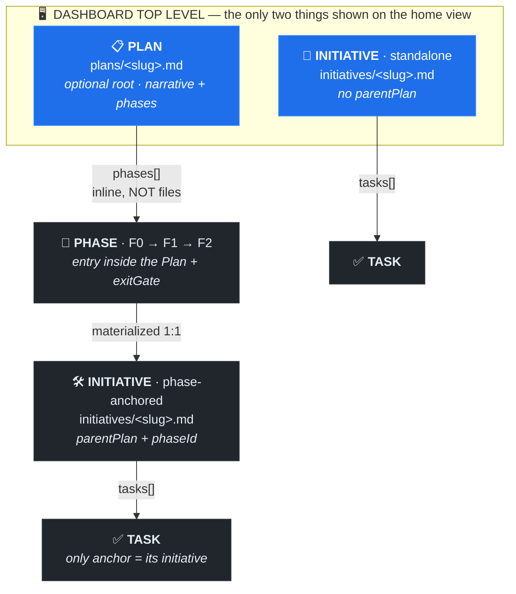

<p align="center">
  
</p>

<p align="center">
  <a href="https://www.npmjs.com/package/@henryavila/atomic-skills"></a>
  <a href="https://www.npmjs.com/package/@henryavila/atomic-skills"></a>
  <a href="https://github.com/henryavila/atomic-skills/blob/main/LICENSE"></a>
</p>

AI agents skip steps, cut corners, and ignore what they promised two messages ago. **Atomic Skills** are battle-tested prompts that make them follow through — each one encodes a hard-won workflow behind Iron Laws and HARD-GATEs that turn *"the agent should do X"* into *"the agent will not proceed without X."*

*Stop babysitting your agent.* Not a prompt pack you copy-paste — install once, then invoke `/atomic-skills:<name>` natively in Claude Code, Cursor, Gemini CLI, Codex, OpenCode, or GitHub Copilot.

### What you get

- **The agent follows through.** Iron Laws and HARD-GATEs make skipping steps *impossible*, not merely discouraged — no fix without a root cause, no "done" without a fresh verification, no push with a secret in the diff.
- **One job per skill.** 14 small, composable skills — diagnose a bug, review a diff, drive a plan to done — with no coupling between them. Reach for the one that matches today's problem.
- **Evidence over vibes.** Every claim cites `file:line` or real tool output; every gate closes against proof, not the agent's say-so.
- **Native in the agent you already use.** A polyglot layer rewrites tool names per IDE, so the *same* skill body runs correctly in Claude Code, Cursor, Gemini CLI, Codex, OpenCode, and GitHub Copilot.
- **60-second install, zero config.** No API keys for the core skills; the installer detects your IDE(s) and writes the command files in place.

> **Where to next:** skim the [14 skills →](#the-skills) · understand the [approach →](#the-atomic-approach) · or just [install →](#quick-start).

## Quick Start

```bash
npx @henryavila/atomic-skills install
```

Interactive by default — it detects your IDE(s) and writes native command files in place. For CI or dotfiles, install for every detected IDE non-interactively:

```bash
npx @henryavila/atomic-skills install --yes --all-detected
```

No config files and no API keys for the core skills. Full update / uninstall / scope options are [at the bottom](#install-update-uninstall).

> **[View on npm](https://www.npmjs.com/package/@henryavila/atomic-skills)** · [browse the skills](#the-skills)

## The Atomic Approach

Vague instructions produce vague results, and a "good prompt" you keep in your head dies with the conversation. Each Atomic Skill encodes hard-won patterns that prevent agent drift:

- **Small** — one skill, one job. No bloat, no dependencies between skills.
- **Specific** — every step names the tool, demands evidence, and defines what "done" looks like.
- **Capable** — Iron Laws, HARD-GATEs, Red Flags, and Rationalization tables. Enforcement that turns *"the agent should do X"* into *"the agent will not proceed without X."*

The difference, concretely. Ask a bare agent to *"fix the bug"* and it patches the first plausible line and declares victory. The `fix` skill refuses that path:

```
reproduce the failure → find the root cause → write a failing test → fix → the test stays green
```

Same request, a process the agent cannot skip.

### Techniques

Every skill is built from the same enforcement primitives. This is the full vocabulary you'll see inside the skill bodies:

| Technique | What it does | Example |
|-----------|-------------|---------|
| **Iron Law** | One non-negotiable rule at the top | `NO FIX WITHOUT ROOT CAUSE` |
| **HARD-GATE** | Mandatory stop before a dangerous action | "If modifying code without a test: STOP" |
| **Precondition Check** | Validate skill fit before paying exploration cost | Q1-Q4: scope consolidated? end states concrete? wallclock gain? independent? |
| **Convergence Criterion** | Stop exploring when hypothesis stabilizes; no arbitrary op limits | "Would the next grep change my decomposition? If no, stop" |
| **Red Flags** | Thoughts that mean you're skipping steps | "I already know what the bug is" |
| **Rationalization Table** | Maps tempting shortcuts to why they fail | "The fix is obvious" → "Obvious to whom? Prove it" |
| **Evidence Requirement** | Every claim must cite line numbers or tool output | "Cite file:line, not 'I checked'" |
| **Escalation Limit** | Max attempts before asking the human | "5 hypotheses failed → escalate" |
| **Test List** | Enumerate test surface before writing any test | Regression + partitions + boundaries + errors |
| **Mental Mutation** | For each condition in the fix: "would a test catch the inverse?" | "If I changed >= to >, would a test catch it?" |
| **Autonomous Mode** | Rules for subagents that can't interact with user | "Auto-split >300 lines, always continue on bugs" |

## The Skills

14 skills, each with one job and one non-negotiable Iron Law — pick the one that matches today's problem.

[VERSION_NOTE_START]: #
> **Note (v2.0.0):** First major bump since 1.8.x. Review skills consolidated from 4 → 2 (`review-plan` + `review-code`) with a Step 0 mode picker (`local` | `codex` | `both`). `project-status` + `project-plan` unified into a single `project` skill — a thin router with lazy-loaded detail files (git-style subcommands, a `verify` reconciliation command, and the aiDeck contract quarantined behind one constant). Catalog moved to schema v0.2 and was renamed to `meta/catalog.yaml`. README + dashboard are now generated from five marker-bounded regions; husky pre-commit auto-regenerates on staged catalog changes.
> See [CHANGELOG.md](CHANGELOG.md) for the full migration matrix.
[VERSION_NOTE_END]: #

### Overview

[SKILLS_TABLE_START]: #
| | Skill | One-liner | Iron Law |
|-|-------|-----------|----------|
| 🔧 | [`fix`](docs/skills/fix.md) | Diagnose root cause → write test → fix → verify | `NO FIX WITHOUT ROOT CAUSE.` |
| 💾 | [`save-and-push`](docs/skills/save-and-push.md) | Scan for secrets, group commits, save learnings, push safely | `NO PUSH WITHOUT FRESH VERIFICATION.` |
| 🔍 | [`review-plan`](docs/skills/review-plan.md) | Adversarial plan review with local/codex/both mode picker | `NO APPROVAL WITHOUT EVIDENCE.` |
| 🔬 | [`review-code`](docs/skills/review-code.md) | Adversarial code review with local/codex/both mode picker | `NO APPROVAL WITHOUT EVIDENCE.` |
| 📊 | [`project`](docs/skills/project.md) | Plan / Initiative / Task state your agent reloads every session | `NO IMPLEMENTATION WITHOUT ANCHORED INITIATIVE.` |
| 📝 | [`prompt`](docs/skills/prompt.md) | Generate a self-contained prompt with exact paths and guardrails | `NO PROMPT WITHOUT CODEBASE ANALYSIS.` |
| 🎯 | [`hunt`](docs/skills/hunt.md) | Adversarial tests from the spec, not the code — depth over breadth | `NO HUNT WITHOUT BOUNDED SCOPE.` |
| 🚀 | [`parallel-dispatch`](docs/skills/parallel-dispatch.md) | Dispatch a task list to N parallel sessions with verified isolation | `NO LAUNCH WITHOUT MECHANICAL SCOPE ISOLATION.` |
| 👁️ | [`parallel-dispatch-audit`](docs/skills/parallel-dispatch-audit.md) | Verify each batch deliverable on disk; fix or escalate with evidence | `NO CONCLUSION WITHOUT EVIDENCE FROM DISK.` |
| 💡 | [`brainstorm`](docs/skills/brainstorm.md) | Diverge, decide, then write a critic-gated design.md before any plan | `NO PLAN WITHOUT AN APPROVED DESIGN.` |
| 🎭 | [`debate`](docs/skills/debate.md) | Roundtable of independent subagent personas for divergent thinking | `NO SYNTHESIS WITHOUT INDEPENDENT VOICES.` |
| ⚙️ | [`implement`](docs/skills/implement.md) | Drive decomposed tasks to done, one at a time, verifier-gated | `CODING STAYS SINGLE-THREADED.` |
| ✅ | [`verify-claim`](docs/skills/verify-claim.md) | No success claim without fresh verification — run it, cite it | `NO SUCCESS CLAIM WITHOUT FRESH VERIFICATION.` |
| 🧠 | [`init-memory`](docs/skills/init-memory.md) | Consolidate scattered memory into .ai/memory/ and wire it to the IDE | `NO DELETION WITHOUT CONFIRMED BACKUP.` |
[SKILLS_TABLE_END]: #

---

[SKILL_DETAILS_START]: #
### 🔧 `fix` — Root Cause + TDD

**Iron Law:** `NO FIX WITHOUT ROOT CAUSE.`

AI agents love to jump to fixes — patch the first plausible line, declare victory, ship the regression. `fix` forces the detective path instead: reproduce the failure, trace it to the exact root cause, write a test that fails for that reason, *then* fix. The reproducing test stays in the suite — so the bug it caught can never silently return.

```
/atomic-skills:fix "duplicates in /musicas listing"
```

[Full reference →](docs/skills/fix.md)

---

### 💾 `save-and-push` — Commit + Memory + Push

**Iron Law:** `NO PUSH WITHOUT FRESH VERIFICATION.`

Ending a session sloppily means a leaked `.env`, one giant unrelated blob commit, and learnings lost to context death. `save-and-push` scans the diff for secrets and sensitive files before staging, groups changes into logical commits (never `git add .`), persists durable learnings to memory, and refuses to push to main/master without confirmation. The next session resumes with clean history and context intact.

```
/atomic-skills:save-and-push
```

[Full reference →](docs/skills/save-and-push.md)

---

### 🔍 `review-plan` — Adversarial (Local + Codex)

**Iron Law:** `NO APPROVAL WITHOUT EVIDENCE.`

A plan reviewed by its own author inherits every blind spot that wrote it — the gaps read as completeness from the inside. `review-plan` runs adversarial passes that actively hunt for what's missing: a fast local self-loop, a cross-model codex envelope that can't see your intent, or both. It surfaces the unhandled edge case, the optimistic assumption, and the silent dependency *before* execution turns them into rework — and never approves without cited evidence.

```
/atomic-skills:review-plan docs/plans/migration.md
```

[Full reference →](docs/skills/review-plan.md)

---

### 🔬 `review-code` — Adversarial (Local + Codex)

**Iron Law:** `NO APPROVAL WITHOUT EVIDENCE.`

Reviewing your own diff in the same context that wrote it inherits every blind spot and rationalization. `review-code` captures the diff once and hands it to a sealed reviewer with clean context — locally, cross-model via codex, or both — stripped of commit messages and intent so framing can't suppress findings. Every finding cites file:line; no evidence, no approval.

```
/atomic-skills:review-code main..HEAD
```

[Full reference →](docs/skills/review-code.md)

---

### 📊 `project` — Plan / Initiative / Task Tracking

**Iron Law:** `NO IMPLEMENTATION WITHOUT ANCHORED INITIATIVE.`

Resume a multi-day project and the agent has forgotten which phase you're in, what's parked, and why a task exists. `project` keeps Plan/Initiative/Task state in `.atomic-skills/` so every session reloads the exact frame — stack frames for side-investigations, an emergence ladder that classifies new work before it lands, exit gates that block advancing until criteria are met, and scope-creep detection. One git-style command for the whole lifecycle: view, create, mutate, discover, migrate, verify.

```
/atomic-skills:project
```

[Full reference →](docs/skills/project.md)

---

### 📝 `prompt` — Generate Optimized Prompt

**Iron Law:** `NO PROMPT WITHOUT CODEBASE ANALYSIS.`

Hand an agent a vague task and you get a vague result — it guesses paths, invents constraints, and drifts from what you meant. `prompt` reads your actual codebase first, then writes a precise, self-contained brief: exact file paths, explicit guardrails, and acceptance criteria the receiving agent can check itself against. Hand it to a parallel session or a fresh context and the work comes back on-target the first time.

```
/atomic-skills:prompt "refactor auth middleware to use new session API"
```

[Full reference →](docs/skills/prompt.md)

---

### 🎯 `hunt` — Adversarial Tests

**Iron Law:** `NO HUNT WITHOUT BOUNDED SCOPE.`

Asking an agent to "add tests" produces happy-path tests that mirror the code — they confirm bugs instead of catching them. `hunt` writes adversarial tests whose expected values come from the spec, not the implementation (a HARD-GATE rejects any assertion derived from the code), and goes deep on one class or function per run instead of skimming. It maps every execution path, then tries to break the boundaries and error cases the code never anticipated.

```
/atomic-skills:hunt src/matcher.php
```

[Full reference →](docs/skills/hunt.md)

---

### 🚀 `parallel-dispatch` — Independent Tasks

**Iron Law:** `NO LAUNCH WITHOUT MECHANICAL SCOPE ISOLATION.`

Fire off parallel agents that happen to touch the same files and you get merge conflicts, clobbered work, and runs you throw away. `parallel-dispatch` refuses to launch until it has *proven* the task scopes are disjoint — pairwise grep across every pair, verified isolation rather than hopeful isolation — then dispatches the batch under one tracking id. You walk away; N agents work in true parallel and their results merge clean.

```
/atomic-skills:parallel-dispatch task-list.md
```

[Full reference →](docs/skills/parallel-dispatch.md)

---

### 👁️ `parallel-dispatch-audit` — Audit

**Iron Law:** `NO CONCLUSION WITHOUT EVIDENCE FROM DISK.`

A green commit can sit on top of an empty file, and a still-running agent looks identical to a failed one. `parallel-dispatch-audit` opens each deliverable on disk and reads the content against the original plan — commit messages don't count as proof. It applies cosmetic fixes only when the batch is clean; the moment it finds five or more issues (or scope drift, a missing deliverable, a destructive op) it flips to read-only and escalates with evidence, because piecemeal fixes would hide that the plan itself was wrong.

```
/atomic-skills:parallel-dispatch-audit onboard-ci
```

[Full reference →](docs/skills/parallel-dispatch-audit.md)

---

### 💡 `brainstorm` — Divergent DESIGN front-half

**Iron Law:** `NO PLAN WITHOUT AN APPROVED DESIGN.`

The failure this prevents is premature convergence — locking onto the first workable approach and writing it up as "the design". `brainstorm` widens before it narrows: it frames the real forks, diverges via a gate-mode debate panel (only when the decision is expensive-to-reverse), lets the user ratify, writes a sectioned `design.md`, and gates it with a fresh independent critic — never panel consensus. PLAN refuses to start without that approved, lint-clean design.

```
/atomic-skills:brainstorm "self-host the project lifecycle"
```

[Full reference →](docs/skills/brainstorm.md)

---

### 🎭 `debate` — Multi-Agent Roundtable

**Iron Law:** `NO SYNTHESIS WITHOUT INDEPENDENT VOICES.`

Ask one model for "the architect''s view and the QA view" and both collapse toward the same voice — convergent, performative, useless for finding blind spots. `debate` spawns each persona as its own subagent so they genuinely disagree, and presents every response unabridged instead of digesting them into your summary. The roster is pluggable (inline list, `.claude/agents/*.md`, `personas/*.md`, or a shipped default), so it runs in any repo. It''s the divergent, human-in-the-loop step that produces the consolidated direction `parallel-dispatch` consumes.

```
/atomic-skills:debate "should we split the monolith now or after launch?"
```

[Full reference →](docs/skills/debate.md)

---

### ⚙️ `implement` — Mode 1 Execution Driver

**Iron Law:** `CODING STAYS SINGLE-THREADED.`

The lifecycle ends in execution, and execution is where state gets lost — work marked done on a claim, context evicted mid-task, a resume that cold-re-investigates. `implement` is a serial loop with durable checkpoints: code one task, gate it through verify-on-done (never a self-asserted pass), snapshot a self-sufficient `## Session handoff` block on observable events (after each task / before each dispatch / phase boundary) — never on a fabricated context-% gauge. Coding stays single-threaded; only heavy reads fan out. The next session resumes from the handoff, and `resume` refuses on a dirty tree or a placeholder.

```
/atomic-skills:implement migration-self-host
```

[Full reference →](docs/skills/implement.md)

---

### ✅ `verify-claim` — Completion-Evidence Gate

**Iron Law:** `NO SUCCESS CLAIM WITHOUT FRESH VERIFICATION.`

A self-graded "it works" is worthless precisely when it matters most — the producer is the party least able to see its own blind spot. `verify-claim` is the completion-evidence gate `implement` calls before any task closes: it reads the VCS diff (not the report), re-executes the task's deterministic verifier, and derives a BINARY verdict from the real result — exit 0 AND, for tests, a non-zero collected count, so a green run of zero tests is the false-green it catches. A cheap or cross-provider executor self-checks but never self-certifies.

```
/atomic-skills:verify-claim T-004
```

[Full reference →](docs/skills/verify-claim.md)

---

### 🧠 `init-memory` — Persistent Context

**Iron Law:** `NO DELETION WITHOUT CONFIRMED BACKUP.`

Memory often already exists but is scattered across `.memory/`, `docs/memory/`, and Claude's auto-memory dir — duplicated, contradictory, or never actually read because it was never wired up. `init-memory` consolidates it into one indexed `.ai/memory/`, connects it via `autoMemoryDirectory` (the durable path, not the fragile redirect), and keeps `MEMORY.md` under the 200-line load limit. Originals are deleted only after an ls-compare confirms every file copied.

```
/atomic-skills:init-memory
```

[Full reference →](docs/skills/init-memory.md)

---
[SKILL_DETAILS_END]: #

---

## The Tracking Model — Plan / Initiative / Phase / Task

> Skip this section if you only want the single-shot skills. It matters when you run `project` for multi-session work.

Resume a multi-day project and the agent has forgotten which phase you're in, what's parked, and why a task exists. `project` keeps that state on disk so every session reloads the exact frame. Four entities; this is how they nest:



> **How to read it.** The two blue boxes are everything the dashboard home shows — *which efforts are live*. Drill into a **Plan** to see its **Phases**, each materialized 1:1 as a phase-anchored **Initiative**; drill into any Initiative (anchored or standalone) to see its **Tasks**. A Task's only direct anchor is its Initiative — Phase and Plan are inherited, never set on the task.

Each entity lives in a known place:

- **Plan** — a multi-phase project: narrative + principles + an ordered list of phases with exit gates. The **optional** root. (`.atomic-skills/plans/<slug>.md`)
- **Initiative** — the unit of *execution*: either one phase of a Plan, or a standalone unit of work. Owns the tasks, the stack, and the parked/emerged lists. (`.atomic-skills/initiatives/<slug>.md`)
- **Phase** — one ordered stage of a Plan, gated by an exit gate. (an *inline entry* in the Plan's `phases[]`)
- **Task** — an atomic action inside an initiative. (frontmatter `tasks[]`)

Three facts the model hinges on, and that most TODO trackers get wrong:

1. **A Phase is not its own file.** It is an inline entry in the Plan's `phases[]` array; the actual *work* for that phase lives in a separate phase-anchored Initiative, linked back via `parentPlan` + `phaseId`. This Plan-phase ↔ Initiative link is the load-bearing relationship.
2. **Plans are optional.** A repo can run on standalone initiatives alone — a Plan is not always the root.
3. **A Task's only direct anchor is its Initiative.** A task lives in exactly one initiative's `tasks[]` and carries no `phaseId` or `parentPlan` of its own. Its Phase and Plan are *inherited* from the initiative's `phaseId` / `parentPlan` — set there, never on the task. So a task cannot live directly on a Plan, cannot belong to two phases at once, and "moving a task to another phase" means moving it into that phase's initiative (which `split-phase` does, preserving `provenance`).

```
.atomic-skills/                       (canonical state; aiDeck dashboard = read-only projection)
│
├── PLAN  plans/<slug>.md             OPTIONAL root — narrative + ordered phases[]
│    └── phases[]  (inline, NOT files)
│         └── PHASE F0 … exitGate
│                └── exitCriterion → verifier ∈ shell | query | test | manual → evidence
│
│         each phase is EXECUTED by one ↓
│
├── INITIATIVE  initiatives/<slug>.md
│    │   phase-anchored → parentPlan + phaseId   |   standalone → neither
│    ├── stack[]    LIFO frames, top = HERE   (push lateral work / pop --resolve|--park|--emerge)
│    ├── tasks[]    TASK {id, title, status, acceptance[], scopeBoundary[]}
│    ├── parked[]   note-for-later   (context REQUIRED)
│    └── emerged[]  real follow-up    (context REQUIRED)
│
└── status/   config.json · hooks/ · last-review.json · bootstrap-drafts/
```

**What shows at the dashboard top level.** The aiDeck home (and the `PROJECT-STATUS.md` index) lists exactly **two** kinds of entry: **active Plans** and **standalone Initiatives**. Everything else is nested *inside* one of those — a phase-anchored Initiative appears under its Plan (never in the standalone table), a Phase is an entry inside its Plan, and a Task is a row inside its Initiative. So the top level answers "which efforts are live?"; you drill into a Plan or Initiative to see phases and tasks.

| Entity | Top level of dashboard? | Where it shows |
|--------|:-----------------------:|----------------|
| Plan | ✅ | "Active Plans" table |
| Initiative (standalone) | ✅ | "Active Initiatives (standalone)" table |
| Initiative (phase-anchored) | ❌ | nested under its Plan |
| Phase | ❌ | inline entry inside its Plan |
| Task | ❌ | row inside its Initiative's `tasks[]` |

**Why you can trust it.** Emergent work — anything that surfaces mid-task — flows through one discipline: **agent proposes → user RATIFIES → agent commits.** Every emergent task or phase is stamped with `provenance` (WHEN/WHO) plus a ratified `context` (WHY: `solves` / `trigger` / `assumesStillValid`). Ratify is a hard gate — a generic *"ok"* or *"yes"* is **not** ratify; you reply `ratify`, paste edits, or `cancel`.

**Phases close against proof, not vibes.** Each exit criterion can carry a machine-checkable `verifier` (`shell` / `query` / `test` / `manual`) and captured `evidence`. No evidence, no advance. (In v0.1, `query` and `test` verifiers are stubbed — you run them externally and report the result.)

**How to use it — one git-style command.** Bare `project` prints a cheap five-line summary (active plan/phase, active initiative + task progress, next action, review status); everything else is a subcommand. Procedures load on demand from `project-assets/`, so the router stays thin.

| Group | What you run |
|-------|--------------|
| **View** | `status` — compact view (`--browser` opens the aiDeck dashboard; `--terminal`/`--list`/`--plan`/`--phase`/`--stack`/`--archived`/`--report` for variants) · `why <id>` — full context of any item · `scope-creep` — drift report |
| **Verify** | `verify` — reconcile `.atomic-skills/` against the repo (schema, branch match, scope coverage, orphans, aiDeck coherence); read-only unless `--fix` |
| **Create** | `new plan <slug>` · `new initiative <slug>` · `adopt <file.md>` (capture an existing markdown plan) · `discover` (scan the repo for in-flight work) |
| **Work the stack** | `push <desc>` / `pop [--resolve\|--park\|--emerge]` — open / close a lateral investigation frame |
| **Backlog** | `park <desc>` (note-for-later) · `emerge <desc>` (real follow-up) · `promote <id>` (parked → task) · `re-ratify <id>` (refresh stale context) |
| **Progress** | `done <task-id>` · `phase-done` (verify gates → review → advance) · `phase-reopen` · `switch <slug>` · `archive [<slug>]` |
| **Structure / legacy** | `new-task` · `new-phase` · `split-phase <id>` · `migrate <slug>` · `re-bootstrap <slug>` · `detect-scope` · `review-due` |

`new-task` / `new-phase` are also **intent-driven**: describe new work in conversation and the emergence ladder classifies it, drafts a `context`, and waits for your `ratify`. Full per-command reference: **[docs/skills/project.md](docs/skills/project.md)**.

**First-time setup.** Run `project` once with no arguments to create `.atomic-skills/` and inject the Iron-Law gate into your `CLAUDE.md` (or equivalent agent config).

→ Full model, commands, schema fields, the emergence ladder, and lifecycle: [docs/concepts/project-tracking.md](docs/concepts/project-tracking.md)

### Tracking in 60 seconds

A team rebuilds its matching engine:

1. **Plan it.** `project new plan rebuild-matcher` points at a spec and decomposes it into a Plan with phases **F0** (Foundation audit), **F1** (New matcher, `dependsOn: [F0]`), **F2** (Cutover). F0's exit criterion *"matcher round-trip test passes"* carries a `{kind: shell, command: "npm test -- matcher"}` verifier. The skill materializes one initiative per phase, activates F0, and runs `review-plan` plus a codex review.
2. **Work it.** `project status` matches the git branch to the active F0 initiative and shows **3/5 tasks done.**
3. **Handle emergence.** Mid-work the agent proposes a new task, prints the mutation block with a drafted `context`, and **HALTs.** The developer types `ratify`; `project new-task --target F1 "Add cross-landlord canary"` lands it with `provenance` + ratified `context`. A smaller idea (*"maybe cache the join later"*) gets `park`ed instead.
4. **Close the phase.** `done T-005` closes the last task; `project phase-done` verifies each exit criterion (stamping `evidence`), runs the `review-code` gate on the phase diff, advances `currentPhase` to F1, archives F0, and seeds the F1 initiative.
5. **Watch for drift.** Weeks later, `scope-creep` flags the parked cache idea as a 40-day zombie with stale context; `re-ratify` refreshes it or retires it.

Every command above is documented in [docs/skills/project.md](docs/skills/project.md).

## Multi-Agent Support

Atomic Skills uses a polyglot rendering layer that detects your agent and rewrites tool names and instructions automatically — the same skill body renders correctly everywhere:

- **Claude Code** — `Bash`, `Read tool`, `Edit tool`, `Agent`.
- **Gemini CLI** — `run_shell_command`, `read_file`, `replace`, `codebase_investigator`.
- **Generic / others** — standardized naming for maximum compatibility.

### Supported IDEs

[IDES_TABLE_START]: #
| IDE | Profile | Directory | Format |
|-----|---------|-----------|--------|
| Claude Code | `claude-code` | `.claude/commands/atomic-skills/` | Command (slash) |
| Cursor | `cursor` | `.cursor/skills/atomic-skills/` | Markdown |
| Gemini CLI (Skills) | `gemini` | `.gemini/skills/atomic-skills/` | Markdown |
| Gemini CLI (Commands) | `gemini-commands` | `.gemini/commands/` | TOML (Slash commands) |
| Codex | `codex` | `.agents/skills/atomic-skills/` | Markdown |
| OpenCode | `opencode` | `.opencode/skills/atomic-skills/` | Markdown |
| GitHub Copilot | `github-copilot` | `.github/skills/atomic-skills/` | Markdown |
[IDES_TABLE_END]: #

For details on the cross-agent rendering layer, see [docs/kb/gemini-cli-compatibility.md](docs/kb/gemini-cli-compatibility.md).

## Modules

Modules bundle optional skills, shared assets, or hooks on top of the core skills. The `memory`, `codex-bridge`, and `auto-update` modules are enabled on every install. To change the active set, use the interactive installer (the `Change modules` / customize-modules action in the `npx @henryavila/atomic-skills install` menu) — there is no `--modules` CLI flag.

[MODULES_START]: #
### Memory

Persistent context across sessions. The agent saves learnings, decisions, and feedback that survive between conversations.

- Configurable path (default: `.ai/memory/`)
- Adds the `atomic-skills:init-memory` skill
- Supports Claude Code's `autoMemoryDirectory` for direct integration (no redirect needed)
- Available in both project and user scope installations

### Codex Bridge (new in 1.8.0)

Shared infrastructure for the codex sub-flow inside `review-plan` and `review-code`. Asset-only module (no invocable skills of its own) — bundles the 11 templates and checklists consumed by the codex envelope:

- Anti-framing directive (literal text injected into every briefing)
- Pre-flight checks, canonical Codex invocation, output validation checklist
- Pass 1 / Pass 2 output templates + Pass 2 prompt suffix (reconciliation block)
- Briefing templates (plan + code) and consolidated review file template
- Reviews INDEX.md row template

Assets are installed per-IDE at `<ide-namespace>/_assets/` (e.g. `.claude/commands/atomic-skills/_assets/`) and referenced from the skills via the `{{ASSETS_PATH}}` template variable.

### Auto-Update (new in 1.8.0)

SessionStart hook that notifies you when a new version is available on npm — without polling or interrupting your flow.

- Hook script installed at `~/.atomic-skills/hooks/version-check.sh`
- Merged into `~/.claude/settings.json` non-destructively (coexists with existing hooks)
- 24h TTL on npm checks; async background fetch (0ms perceived latency)
- Opt-out via `ATOMIC_SKILLS_NO_UPDATE_CHECK=1` env var
- Configurable TTL via `ATOMIC_SKILLS_UPDATE_CHECK_TTL=<seconds>`
- Currently covers **Claude Code** only (Cursor, Gemini CLI, Codex, OpenCode, GitHub Copilot have different lifecycles)
[MODULES_END]: #

## Install, Update, Uninstall

```bash
# Interactive: choose user scope or project scope
npx @henryavila/atomic-skills install

# Non-interactive project scope: install into the current repo's Git root
npx @henryavila/atomic-skills install --project

# Same command updates an existing install (preserves local edits via 3-hash diff)
npx @henryavila/atomic-skills install

# Inspect which IDEs are supported and which were detected on disk
npx @henryavila/atomic-skills detect [--project] [--json]

# Show installed skills, language, and per-IDE file status
npx @henryavila/atomic-skills status [--project]

# Remove everything (interactive: asks for confirmation first)
npx @henryavila/atomic-skills uninstall [--project]

# Non-interactive uninstall for scripts (skips the confirmation prompt)
npx @henryavila/atomic-skills uninstall --yes [--project]
```

**Uninstall removes everything the installer wrote:** the skill/command files,
shared assets, the namespace root, the manifest, and the auto-update
`SessionStart` entry in `settings.json` (surgically — other hooks are kept). A
**user-scope** uninstall also reclaims the global runtime under `~/.atomic-skills/`
(`bin/`, `dashboard/`, `aideck-consumer/`, `src/`); a **project-scope** uninstall
leaves that global runtime in place, since other repos share it. Your own data in
`~/.aideck/` (plans, initiatives) and the `.atomic-skills/` project-tracking tree
are never touched. (The installer does not add `.atomic-skills/` to `.gitignore` —
that tree is meant to be versioned alongside your code.)

`uninstall` prompts for confirmation when run directly (defaults to *no*). Pass
`--yes` (or `-y`) to skip the prompt in scripts. With both a user-scope and a
project-scope install present, `--yes` without `--project` targets the user scope.

**Scope trade-off:**
- *user scope* (default): one install serves every project; not versioned in git.
- *project scope* (`--project` or the installer picker): skills live in the current repo's Git root, are versioned, and overlay the user scope. Pick this for teams.

Re-running `install` updates in place and never clobbers files you edited (3-hash conflict detection). Per-IDE install directories are in [Supported IDEs](#supported-ides).

## Development & Contributing

To ensure cross-agent compatibility, Atomic Skills includes a test suite that acts as a linter for prompt templates:

```bash
npm test
```

It verifies:

1. **Tool name abstraction** — no hardcoded tool names (like `Bash` or `Read tool`) in the source `.md` files.
2. **Conditional rendering** — agent-specific instructions are correctly included/excluded for Claude and Gemini.
3. **Multi-format export** — Markdown and TOML generation for all supported profiles.

The same discipline the skills enforce on your agent, the repo enforces on itself.

**Generation contract.** The README skills table and per-skill blurbs, the per-skill docs, the IDEs table, the modules section, and the version note are **generated** from `meta/catalog.yaml` + `src/config.js` via `scripts/lib/render-readme.js`; a husky pre-commit regenerates these regions (and the dashboard data) when their inputs are staged. **Never hand-edit inside the marker regions.** To add or change a skill, edit the catalog (`value_pitch`, `one_liner`, args) and the skill body, and use the tool variables from `AGENTS.md` — never hardcoded tool names.

See also [docs/kb/gemini-cli-compatibility.md](docs/kb/gemini-cli-compatibility.md) and [docs/kb/skill-frontmatter-spec.md](docs/kb/skill-frontmatter-spec.md).

## License

MIT
