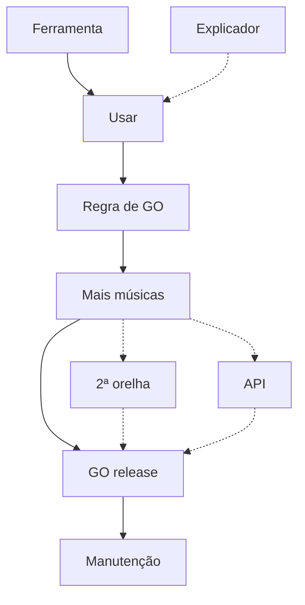
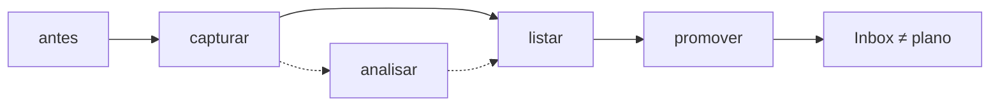
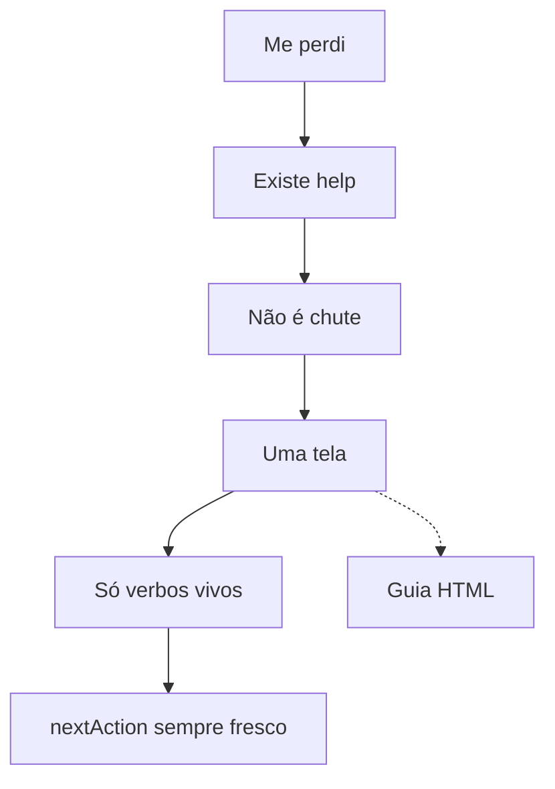
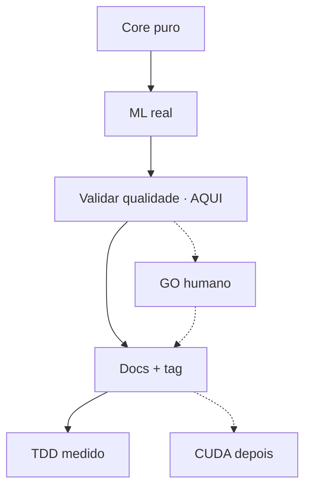

# Process Map — construction sketches (validar construção, não visual)

**Data:** 2026-08-09 · **Rev:** 2026-08-10 (audiência / duas lentes)  
**Status:** **SUPERSEDED as product SoT** by `docs/kb/process-map.md` (2026-08-10).  
Kept as **historical construction panel** only.

**Product contract (binding):**
- Iron Law P1: NO PLAN WITHOUT PROCESS MAP  
- L1 `process/process.yaml` authored at plan creation by Atomic Skills  
- L2 `process/map.html` rendered deterministically from L1  
- Never optional; never phase-tree rename; titan is one example domain only  

**This file was:** construction validation + dual lenses.  
**Do not** treat Sketch 4 (titan phase-collapse) as the template for L1 — use Sketch 1 (quality-judge) shape: objective confidence journey.

**Como ler**

| Campo | Significado |
|-------|-------------|
| `kind` | `done` · `main` · `optional` · `always` |
| `copy.layperson` | Lente leigo — valor e confiança, zero engenharia |
| `copy.developer` | Lente dev abstraído — processo do objetivo + domínio alto nível |
| `mapsToPhases` | Ligação opcional a F* (meta; não na UI default) |
| `sourcedFrom` | De onde o marco foi extraído (construção; não no HTML) |

**Legenda de arestas:** `→` solid (obrigatório) · `⇢` dashed (opcional)

---

## Princípio canônico — Linguagem de Produto em duas lentes

> **Processo do objetivo, em duas lentes.**  
> - **Leigo (`layperson`):** só resultado e confiança. Zero jargão de engenharia.  
> - **Dev abstraído (`developer`):** o *mesmo* processo, com conceitos de domínio de alto nível (ML, validar qualidade, estado…). **Sem** decomposição de implementação.  
> Em ambos: **não** é o grafo de fases/tasks do Atomic Skills.

**Por que dev ainda é “produto”:** com IA, o dev (ex.: o próprio operador) toca tecnologias que não domina 100%. O mapa dev **não** pode virar F0/T-003/paths — ainda precisa do fluxo do objetivo, só com abstração de domínio (“aplicar ML de acordes”, “validar qualidade no corpus”).

| | Leigo | Dev abstraído | Implementação (fora do mapa) |
|--|-------|---------------|------------------------------|
| Fala de | O que ganho / confio | Capacidade de domínio | Tasks, arquivos, verifiers |
| Exemplo | “Ouvir só o duvidoso” | “Triar fila CONFIO/REVISA do juiz” | `T-012` + path do harness |
| Teste | Não-dev entende a caixa | Dev de outro projeto entende o fluxo **sem** abrir o repo | — |

**Iron laws do mapa**

1. **NO MAP AS IMPLEMENTATION TREE** — proibido grafo = `phases[]` renomeadas.  
2. **AUDIENCE IS A LENS, NOT A DIFFERENT PLAN** — um grafo; duas cópias.  
3. **DEV ≠ CÓDIGO** — lente developer proíbe paths, `T-`, “implementar X”, nomes de arquivo.

---

## Entrada da skill — AskUserQuestion

Quando a skill monta ou abre o mapa (`project process`, stage de mapa no `new plan`, gate pré-`implement` se `audience` ausente):

**Pergunta:** *Este mapa é para quem?*

| Opção | Quando usar |
|-------|-------------|
| **Quem não é de tech** | Stakeholder / músico / PO sem stack |
| **Dev, em alto nível** *(útil no dia a dia com IA)* | Operador-dev; domínio sim, implementação não |
| **Os dois** | HTML com toggle Leigo ↔ Dev; mesmo grafo |

Persistir em `audience: layperson | developer | both`.  
Reabrir: **reusar** o valor salvo; só reperguntar se ausente ou `process --audience`.

```
project process / new plan (mapa) / pré-implement
        │
        ▼
 AskUserQuestion: leigo | dev abstraído | ambos
        │
        ▼
 Draft grafo canônico (etapas + edges + kind)
        │
        ▼
 Preencher copy da(s) lente(s) pedida(s)
        │
        ▼
 Ratify (não aceitar "ok" genérico se copy fraca / collapse)
        │
        ▼
 Render HTML na lente (+ toggle se both)
```

---

## Checklist de validação

| # | Pergunta | S1 | S2 | S3 | S4 |
|---|----------|----|----|----|-----|
| Q0 | Grafo canônico único (lentes só no copy)? | | | | |
| Q1 | Mapa **≠** só `phases[]` renomeadas? | | | | |
| Q2a | Lente **leigo** sem jargão de engenharia? | | | | |
| Q2b | Lente **dev** sem paths/T-/implementar, só domínio? | | | | |
| Q3 | Há `optional` / `always` de verdade? | | | | |
| Q4 | `youAreHere` honesto? | | | | |
| Q5 | Schema com `copy.layperson` + `copy.developer` basta? | | | | |
| Q6 | AskUserQuestion na entrada faz sentido? | | | | |
| Q7 | Autoria: draft + ratify por lente? | | | | |

**Hipótese:** se Q1 falha no *grafo* mas Q2a/Q2b passam no *copy*, o mapa ainda vale (pin + lentes + optional/always).

---

## Schema v1 (com lentes)

```yaml
schemaVersion: '0.1'
planSlug: string
actor: string
scenario: string              # processo do objetivo em 1 frase
youAreHere: string|null
audience: layperson|developer|both   # última escolha de render
stages:
  - id: kebab
    kind: done|main|optional|always
    mapsToPhases: [F0]        # optional, meta
    sourcedFrom: string       # review only
    copy:
      layperson:
        name: string
        youGain: string
        unlocks: string
      developer:
        name: string
        youGain: string
        unlocks: string
edges:
  - { from, to, style: solid|dashed }
constructionNotes: string
```

**Lint (candidato)**

- `copy.*.name|youGain|unlocks`: ban `T-\d+`, path-like, `implementar`, `verifier`, `materialize` solo.  
- Lente leigo: ban tokens de domínio pesado se configurável (opcional v1.1).  
- Collapse: `main.length == phases.length` + bijeção `mapsToPhases` → warning (não HARD se optional/always existirem).

---

# Sketch 1 — quality-judge-program (referência)

**Fonte:** `chord-engine/docs/superpowers/plans/2026-08-09-quality-judge-program.md`  
**Tipo:** operacional / qualidade · **Pin:** `usar`  
**Grafo:** independente de F* (plano não-código)

### Grafo canônico

```
ferramenta(done) → usar → regra-go → mais-musicas → go-release → manutencao(always)
                         mais-musicas ⇢ segunda-orelha ⇢ go-release
                         mais-musicas ⇢ api-paga ⇢ go-release
                         explicador ⇢ usar
```

### Copy por lente (tabela)

| id | kind | Leigo — name | Leigo — youGain | Dev — name | Dev — youGain |
|----|------|--------------|-----------------|------------|---------------|
| ferramenta | done | Ferramenta pronta | O sistema diz se confia, se você deve revisar, ou se deve desconfiar — e mostra trechos | Juiz 3 camadas operacional | Veredito CONFIO / REVISA / DESCONFIE + candidatos A/B por trecho |
| usar | main | Usar no dia a dia | Você só gasta ouvido onde o sistema pediu | Rotina de calibração no sample | Rodar juiz no sample de 3; triar fila; gravar decisões A/B |
| regra-go | main | Combinar o que é “pronto” | Todo mundo sabe o que pode lançar vs ainda não | Política de GO de produto | Escolher dual (conteúdo+placement) / só conteúdo / legado — gate explícito |
| mais-musicas | main | Testar em mais músicas | O critério vale para muitas músicas, não só 3 | Expandir + estabilizar critério | Rodar corpus maior; aceitar/ajustar limiar de CONFIO |
| go-release | main | Fechar o release | Assina com evidência, não feeling | GO oficial com pasta de evidências | Assinatura + artefatos de confiança; tag / fase de qualidade |
| segunda-orelha | optional | Segunda orelha humana | Saber se o “certo” humano também é discutível | Peer review de gabarito | Comparar GT humano em casos duvidosos |
| api-paga | optional | Terceiro palpite pago | Desempate barato em casos difíceis | Sinal externo de acordes | API comercial como 3º voto no desempate |
| explicador | optional | Explicar a dúvida em português | Menos intimidação na fila | Assistente de explicação A vs B | Texto simples do conflito harmônico (conforto, não GO) |
| manutencao | always | Não deixar o critério envelhecer | Próximas versões ainda confiáveis | Revalidar quando o detector muda | Re-rodar conjunto fixo se mudar detecção ou gabarito |

```yaml
# recorte schema (1 estágio)
- id: usar
  kind: main
  mapsToPhases: []
  sourcedFrom: §0.1 P0
  copy:
    layperson:
      name: Usar no dia a dia
      youGain: Você só gasta ouvido onde o sistema pediu
      unlocks: Confiança no fluxo com o sample de 3
    developer:
      name: Rotina de calibração no sample
      youGain: Rodar juiz no sample; triar fila; gravar A/B
      unlocks: Base empírica antes da regra de GO
```

**constructionNotes:** Melhor referência de LP. Lente leigo ≈ §0 do source. Lente dev acrescenta domínio (sample, limiar, dual) sem virar código. Q1 grafo: **pass**.



---

# Sketch 2 — quick-idea-capture (AS, simples)

**Fonte:** `.atomic-skills/.../quick-idea-capture/plan.md`  
**Tipo:** feature operador · **Status:** archived · F0+F1 done  
**youAreHere:** null

### Grafo canônico

```
antes(done) → capturar-barato → listar → promover → nao-poluir(always)
              capturar-barato ⇢ analisar-na-captura ⇢ listar
```

### Copy por lente

| id | kind | Leigo | Dev abstraído |
|----|------|-------|---------------|
| **antes** | done | **Name:** Ideia solta na cabeça · **Ganha:** (risco) esquecer ou virar trabalho cedo demais | **Name:** Intenção ainda fora do sistema · **Ganha:** Nada persistido — só pressão para capturar |
| **capturar-barato** | main | **Name:** Anotar a ideia em segundos · **Ganha:** Fica guardada sem virar projeto | **Name:** Append barato no inbox · **Ganha:** `ideas.md` atualizado; caminho “só salvar” sem análise cara |
| **listar** | main | **Name:** Ver o que está pendente · **Ganha:** Lembra o que capturou | **Name:** Listar inbox · **Ganha:** Visão scannable das ideias pending |
| **promover** | main | **Name:** Transformar em trabalho de verdade · **Ganha:** Ideia vira tarefa/projeto com confirmação sua | **Name:** Promote + ratify via ladder · **Ganha:** Roteia para task/initiative; marca triaged; sem reinventar classificação |
| **analisar-na-captura** | optional | **Name:** Pensar um pouco na hora · **Ganha:** Captura mais clara quando vale a pena | **Name:** Fork “Analisar” na captura · **Ganha:** Mais contexto no inbox — ainda sem promover |
| **nao-poluir** | always | **Name:** Inbox não é o plano · **Ganha:** Painel de projeto limpo | **Name:** Inbox fora do modelo plan/initiative · **Ganha:** Disciplina P4 contínua |

**mapsToPhases:** capturar/listar/analisar → F0; promover → F1.

**constructionNotes:** 2 phases → 5 marcos (sub-marcos + optional). Dev cita `ideas.md` / ladder como *domínio do pack*, não como tasks. Q1: parcial (main ~ F0→F1); optional/always salvam.



---

# Sketch 3 — help-command (AS, GPS)

**Fonte:** `.atomic-skills/.../help-command/plan.md`  
**Tipo:** orientação · **Status:** done · **youAreHere:** null (uso contínuo = always)

### Grafo canônico

```
estado-opaco(done) → contrato-existe → mapa-deterministico → uma-tela → fidelidade → nextaction-sot(always)
                                                       uma-tela ⇢ guia-html
```

### Copy por lente

| id | kind | Leigo | Dev abstraído |
|----|------|-------|---------------|
| **estado-opaco** | done | **Name:** Voltei e me perdi · **Ganha:** (dor) não sei o que fazer agora | **Name:** Sessão fria sem GPS · **Ganha:** (dor) fase/nextAction não óbvios |
| **contrato-existe** | main | **Name:** Existe um “me orienta” · **Ganha:** Posso pedir onde estou | **Name:** Verbo `help` no sistema · **Ganha:** Comando read-only, fail-open, no router |
| **mapa-deterministico** | main | **Name:** A resposta não é chute · **Ganha:** Confio que o próximo passo é o certo | **Name:** Helper estado→próximo passo · **Ganha:** Classificação determinística (não prosa que inventa comando) |
| **uma-tela** | main | **Name:** Tudo em uma tela · **Ganha:** Onde estou + o que fazer + por quê + se travar | **Name:** Bloco de ensino terminal · **Ganha:** VOCÊ ESTÁ AQUI / FEITO / PRÓXIMO / POR QUÊ / SE TRAVAR |
| **fidelidade** | main | **Name:** Não me manda fazer o impossível · **Ganha:** Só sugere o que existe de verdade | **Name:** Guarda de verbos vivos · **Ganha:** GPS nunca cita comando que não existe no pack |
| **guia-html** | optional | **Name:** Ver o guia em página · **Ganha:** Entender o sistema sem ler manual enorme | **Name:** `help --html` · **Ganha:** Mesmo conceito no onboarding HTML offline |
| **nextaction-sot** | always | **Name:** O “próximo passo” continua atualizado · **Ganha:** Toda vez que volto, o GPS serve | **Name:** nextAction autorado nas transições · **Ganha:** help e resumo barato nunca divergem no comando |

**mapsToPhases:** contrato→F0, mapa→F1, uma-tela→F2, fidelidade→F3; html/always → [].

**constructionNotes:** **FLAG Q1 no grafo** — main ≈ F0–F3. Lentes **salvam o valor**: leigo = jornada de “me achei”; dev = domínio do GPS (nextAction, fail-open) **sem** “contrato + esqueleto”. Lint de collapse deve **avisar**, não matar, se optional/always + copy LP existirem.



---

# Sketch 4 — titan-v01 (produto real)

**Fonte:** `titan-chordpro-lib/.../titan-v01/plan.md`  
**Tipo:** produto áudio→ChordPro · **Pin:** `qualidade-release` (F2 active)  
**POV escolhido neste sketch:** dono do release (Henry). *Ver nota POV abaixo.*

### Grafo canônico

```
nucleo-puro(done) → motores-reais(done) → qualidade-release → docs-e-tag → tdd-medido(always)
                              qualidade-release ⇢ go-humano-divergencias ⇢ docs-e-tag
                              docs-e-tag ⇢ cuda-depois
```

### Copy por lente

| id | kind | Leigo | Dev abstraído |
|----|------|-------|---------------|
| **nucleo-puro** | done | **Name:** Já dá para montar uma cifra “de mentira” · **Ganha:** Formato e fluxo existem sem mágica de IA pesada | **Name:** Core puro (schemas, fusion, writer, CLI) · **Ganha:** Pipeline mockável ponta a ponta sem engines ML reais |
| **motores-reais** | done | **Name:** A máquina escuta músicas de verdade · **Ganha:** Áudio real vira proposta de acordes + letra | **Name:** Engines ML reais no pipeline · **Ganha:** Separation / transcription / chord / beat / … na factory |
| **qualidade-release** | main | **Name:** Provar que está bom o bastante para lançar · **Ganha:** Número + ouvido humano nas piores falhas | **Name:** Validar qualidade no corpus · **Ganha:** Loop WCSR/placement + harness no corpus; até release-credible |
| **docs-e-tag** | main | **Name:** Empacotar para outras pessoas usarem · **Ganha:** Versão estável com explicação | **Name:** Docs de método + tag 0.1.0 · **Ganha:** Artefatos de uso + tag estável para consumidores (ex. curta) |
| **go-humano-divergencias** | optional | **Name:** Você assina as piores divergências · **Ganha:** Não confia só no número | **Name:** GO humano no top-N de erros · **Ganha:** Owner review ≤3 Titan-wrong graves |
| **cuda-depois** | optional | **Name:** Mais rápido / outras máquinas (depois) · **Ganha:** Escala quando precisar | **Name:** CUDA / engines v0.2 · **Ganha:** Fora do 0.1 Mac-first — non-goal agora |
| **tdd-medido** | always | **Name:** Qualidade não é feeling · **Ganha:** Próximas mudanças não rebentam o que já confia | **Name:** Features atrás de teste + gates medidos · **Ganha:** P3 contínuo (TDD + WCSR/human) |

**mapsToPhases:** nucleo→F0, motores→F1, qualidade+go-humano→F2, docs→F3.

**POV dual (flag de produto):**

| Lente + POV | Cenário |
|-------------|---------|
| Leigo · dono | “Quero lançar cifras confiáveis” (este sketch) |
| Leigo · usuário final | “Sobo áudio → edito ChordPro → confio no acorde na sílaba” — *grafo poderia ser outro* |
| Dev · dono | Pipeline de capacidades Mac-first até tag (este sketch) |

Se o AskUserQuestion de audiência for leigo **e** o plano tiver usuário final distinto do operador, **segunda pergunta** (v1.1): *mapa do dono do release ou do usuário final?*

**constructionNotes:** Main ≈ F0–F3. Lente dev é o exemplo-pedido: “aplicar ML…”, “validar qualidade…”, “tag” — **não** “Phase C Validation”. BI.workflow (áudio→fusion→harness) alimenta dev; BI.value alimenta leigo.



---

# Síntese cruzada (rev. lentes)

| Sketch | Grafo ≈ phases? | Leigo forte? | Dev abstraído forte? | Valor do mapa |
|--------|-----------------|--------------|----------------------|---------------|
| 1 quality-judge | Não | Sim (§0) | Sim (domínio juiz/calibração) | **Alto** |
| 2 quick-idea | Parcial | Sim | Sim (inbox/ladder domínio pack) | **Médio+** |
| 3 help | Sim (1:1 main) | Sim (jornada “me achei”) | Sim (GPS/nextAction, sem F-titles) | **Médio** *só com lentes* |
| 4 titan | Sim (1:1 main) | Sim (lançar cifras) | Sim (ML→validar→tag) | **Médio+** *pin + POV* |

## Regras de construção (atualizadas)

1. **Grafo primeiro** (processo do objetivo); copy por lente depois.  
2. **AskUserQuestion** escolhe lente de *render/draft de copy*, não outro grafo.  
3. **Fontes:** (a) seção humana tipo §0 (b) BI value/doneWhen → leigo (c) BI workflow/outOfScope + principles → dev/always (d) phases só como fallback de *ordem*, nunca de *nome* cru.  
4. **Dev abstraído:** domínio (“aplicar ML”, “validar estado/qualidade”); ban implementação.  
5. **Collapse warning** se main bijeta phases — OK se lentes + optional/always carregarem valor.  
6. **POV** (dono vs end-user) é eixo ortogonal a leigo/dev — perguntar só quando o plano tiver os dois.

## Decisões pedidas (anote no mdprobe)

1. Schema v1 (`copy.layperson` / `copy.developer`) fecha?  
2. Opções do AskUserQuestion: só 2, ou “ambos” no MVP?  
3. Em help/titan, mapa **vale** com lentes mesmo com collapse do grafo?  
4. Segunda pergunta POV (dono vs usuário final) no MVP ou v1.1?  
5. Default de `audience` quando multi-phase de tooling AS: `developer`?

---

## Próximo passo (depois desta review)

- Congelar: grafo canônico + duas lentes + AskUserQuestion.  
- 1 template HTML com toggle se `both`.  
- **Não** implementar o pack ainda.

---

*Rev 2026-08-10 — audiência / Linguagem de Produto em duas lentes. Anote no mdprobe por seção.*
