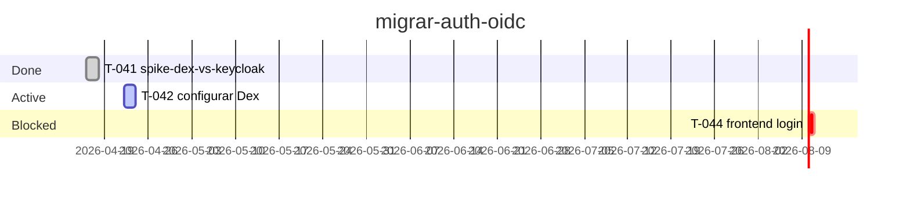
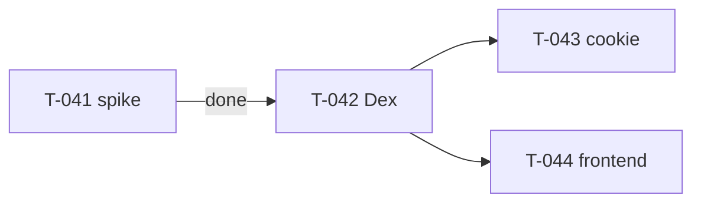

# `atomic-skills:project-status` — Canonical Per-Initiative Status Tracking

**Status:** Approved v2 (pending implementation plan)
**Date:** 2026-04-22
**Scope:** New skill that maintains a canonical, AI-optimized project-status tree per initiative, enforced via hooks and CLAUDE.md/AGENTS.md hard-gate, with terminal + browser rendering.
**Supersedes:** v1 (same file, pre-annotations review)

---

## 1. Problem

During long-running coding work, users and AI agents lose the macro view. The pattern is consistent:

1. User starts task A (part of a planned N-task initiative)
2. Working on A reveals need to expand → sub-tasks A.1, A.2
3. A.1 requires research R → research performed
4. R sparks discussion about topic T → T is discussed
5. T reveals concern C → C is discussed
6. By end of session, both user and AI have lost:
   - What was the original goal?
   - What's the breadcrumb back?
   - What surfaced that still needs handling?
   - What scope has expanded vs. what emerged as a different initiative?

Existing tooling addresses parts:
- **TodoWrite/TaskCreate** — ephemeral, dies on compaction, does not survive sessions
- **`.ai/memory/MEMORY.md`** — durable *learnings*, not operational status
- **`superpowers:writing-plans`** — written-once design, no living status
- **`ck` (everything-claude-code)** — session-scope continuity, not initiative-scope
- **ADRs** — architectural decisions, orthogonal to execution progress

**Gap:** No canonical source for *living, per-initiative execution status* that survives across sessions, branches, and worktrees — and that is *enforced* to be read and written, not merely recommended.

## 2. Design Principles

1. **AI-native storage + human rendering both in-scope** — storage format optimized for LLM read/write efficiency; human rendering (terminal compact + browser rich) is part of THIS skill, not deferred to another.
2. **Defense in depth** — three independent enforcement layers (skill + rule file + hooks). Any one by itself fails; together they hold.
3. **Multi-IDE first, Claude Code amplified** — skill + CLAUDE.md/AGENTS.md work everywhere; hooks add Claude-Code-specific amplification.
4. **Depth-first workflow, not scope-creep policing** — the user legitimately explores deeper. The skill must make the *breadcrumb visible*, not prevent exploration.
5. **Composable with existing skills** — `init-memory`, `save-and-push`, `writing-plans`, `ck` remain; this skill fills a specific gap and references them.
6. **Research-backed format** — YAML frontmatter for structured state + Markdown body for narrative. Terminal renders as tree + table + lists; browser renders with Mermaid diagrams via mdprobe.
7. **Opt-in enforcement intensity** — setup offers levels (passive / soft / strict). User controls friction.
8. **Scope emergent from tool activity** — cross-repo work auto-tracked from Write/Edit/Read paths observed during session; no manual declaration.

## 3. Non-Goals

- **Not a planning tool.** `superpowers:writing-plans` owns initial plan creation. This skill links to plans; it does not replace them.
- **Not a learning repository.** `save-and-push` and `init-memory` own `.ai/memory/`. This skill does not write learnings.
- **Not a replacement for the CLI `npx atomic-skills status` command.** The CLI command (already exists in `src/status.js`) shows install manifest. This skill (`atomic-skills:project-status`) is invoked inside IDEs and tracks implementation state. Different contexts, different purposes, both coexist.
- **Not cross-organization coordination.** The host repo (where the AI agent is opened) centralizes tracking. If multiple contributors work on the same initiative, merge conflicts are expected and managed via git as usual.
- **Not a task manager.** It is a canonical state file that happens to contain tasks. No assignees, due dates, or external integrations.

## 4. Architecture Overview

### File layout

```
.atomic-skills/
├── PROJECT-STATUS.md               ← index: active initiatives + last 10 archived + last 5 ad-hoc sessions
├── initiatives/
│   ├── <slug>.md                   ← Stack + Tasks + Parked + Emerged + Next Action (YAML frontmatter + MD narrative)
│   └── archive/
│       └── <YYYY-MM>-<slug>.md     ← archived initiatives, preserved
└── status/                          ← runtime of the project-status skill (not project data)
    ├── hooks/
    │   ├── session-start.sh
    │   └── stop.sh
    ├── config.json                  ← source-code globs, strict_mode flag, dry-run start date
    └── stop.log                     ← dry-run decision log (gitignored)

AGENTS.md                            ← root. Auto-created if missing, with @CLAUDE.md redirect
CLAUDE.md                            ← root. HARD-GATE block injected idempotently between markers
.claude/settings.local.json          ← if Claude Code. Registers hooks pointing to .atomic-skills/status/hooks/
```

**Naming convention:** `.atomic-skills/` is reserved namespace for atomic-skills tooling. `PROJECT-STATUS.md` and `initiatives/` are *project data* (what the skill produces for the project). `status/` is *skill runtime* (hooks, config, logs specific to project-status skill). Future atomic-skills can similarly live under `.atomic-skills/<skill-name>/` without collision.

### Three enforcement layers

| Layer | Mechanism | Setup cost | IDE scope | Strength |
|-------|-----------|------------|-----------|----------|
| **L1** | `atomic-skills:project-status` skill | Install atomic-skills (usable immediately) | All IDEs | Soft — requires user (or hook-triggered) invocation |
| **L2a** | `<HARD-GATE>` in CLAUDE.md + AGENTS.md redirect | Auto-installed by skill setup | All (any IDE reading CLAUDE.md or AGENTS.md) | Soft — prompt-level, decays with context |
| **L2b** | `SessionStart` hook injecting current status via `additionalContext` | Auto-installed by skill setup | Claude Code | Medium — guaranteed injection each session, re-fires after `/compact` |
| **L3** | `Stop` hook predicate check (dry-run → strict after 7d grace) | Auto-installed by skill setup | Claude Code | Strong — forces continuation; requires tuning |

## 5. Initiative Lifecycle

```
[none] --start--> [active] --archive--> [archived]
                      |
                      +--stack-push--> deeper frame active
                      +--stack-pop---> parent frame active (or archive if root popped)
                      +--park--------> item captured in Parking Lot (same initiative)
                      +--emerge------> item captured in Emerged (different initiative)
                      +--promote-----> Parking item → In Progress task
                      +--done--------> task → Done
                      +--pause-------> active → paused (optionally resumable)
                      +--switch------> active → paused, other initiative → active
```

States are encoded in the YAML frontmatter. `status` field is machine-authoritative.

## 6. The `atomic-skills:project-status` Skill

### Iron Law

`NO IMPLEMENTATION WITHOUT ANCHORED INITIATIVE.`

Every code-modifying session must either (a) be anchored to an active initiative file on disk, or (b) be explicitly declared ad-hoc by the user. "Anchored" means: the initiative's slug is known, its file exists, and the current stack frame reflects reality.

### Context-aware default behavior

When invoked with no args, the skill detects state and branches:

| Detected state | Default behavior |
|---|---|
| No `.atomic-skills/` directory exists | Enter **setup flow** (create directories, inject CLAUDE.md HARD-GATE, create AGENTS.md if missing, install hooks, choose enforcement level) |
| Structure exists + active initiative + branch matches | **Display compact terminal view** of that initiative |
| Structure exists + active initiative + branch does NOT match | **Disambiguation flow**: continue X / lateral of X / new / ad-hoc |
| Structure exists + multiple active initiatives + no branch match | **Display `--list` view** (tabular) and ask which to focus |
| Structure exists + no active initiative | Offer: start new, resume archived, declare ad-hoc |
| Structure exists + CLAUDE.md HARD-GATE missing or stale | Offer to re-inject |

### Invocation patterns

| Invocation | Behavior |
|------------|----------|
| `atomic-skills:project-status` | Default context-aware (see table above) |
| `atomic-skills:project-status new <slug>` | Bootstrap new initiative interactively |
| `atomic-skills:project-status push <description>` | Push new frame onto current stack |
| `atomic-skills:project-status pop [--resolve\|--park\|--emerge]` | Pop top frame; route its content to resolve/park/emerge |
| `atomic-skills:project-status park <description>` | Add item to Parking Lot (same initiative) |
| `atomic-skills:project-status emerge <description>` | Add item to Emerged (different initiative) |
| `atomic-skills:project-status promote <parking-item-id>` | Move Parking item to In Progress, optionally assign task ID |
| `atomic-skills:project-status done <task-id>` | Mark task Done, record `closed_at` |
| `atomic-skills:project-status archive [<slug>]` | Archive initiative to `initiatives/archive/` |
| `atomic-skills:project-status switch <slug>` | Pause current active, activate another |
| `atomic-skills:project-status disambiguate` | Explicitly trigger disambiguation flow |
| `atomic-skills:project-status <slug>` | Display specific initiative (detail view) |
| `atomic-skills:project-status --list` | List all active initiatives (tabular) |
| `atomic-skills:project-status --stack` | Show only the stack of active initiative (3-8 lines) |
| `atomic-skills:project-status --browser [<slug>]` | Render full initiative to MD and open in mdprobe |
| `atomic-skills:project-status --report` | Emit pasteable cross-initiative MD to stdout |
| `atomic-skills:project-status --archived` | List last 10 archived initiatives |

### Setup flow (first invocation, no `.atomic-skills/` exists)

1. Detect IDE environment (`.claude/`, `.cursor/`, `.gemini/`, etc.)
2. Check for existing `CLAUDE.md`. If absent, offer to create minimal one (title + HARD-GATE block).
3. Check for existing `AGENTS.md`. If absent, create with `@CLAUDE.md` redirect (see §10). If present and doesn't reference CLAUDE.md, *suggest* (with diff) adding reference — do not force.
4. Inject HARD-GATE block into `CLAUDE.md` between markers `<!-- atomic-skills:status-gate:start -->` and `<!-- atomic-skills:status-gate:end -->`. Idempotent — re-running detects markers.
5. If Claude Code (`.claude/` exists), offer three enforcement levels:
   - **Passive**: only L2a (CLAUDE.md HARD-GATE). No hooks installed.
   - **Soft** (default): L2a + L2b (SessionStart injection).
   - **Strict**: L2a + L2b + L3 (Stop hook). L3 is **always installed in dry-run mode initially** regardless of user's final intent; after 7-day grace window the skill offers promotion to real enforcement (see §12).
6. Create `.atomic-skills/PROJECT-STATUS.md` skeleton.
7. Create `.atomic-skills/initiatives/` and `.atomic-skills/initiatives/archive/` directories.
8. Create `.atomic-skills/status/hooks/` with `session-start.sh` and (if Strict) `stop.sh`.
9. Create `.atomic-skills/status/config.json` with defaults.
10. Write `.atomic-skills/status/stop.log` placeholder and add to `.gitignore`.
11. Report what was installed with file paths and rollback instructions.

## 7. File Format — `.atomic-skills/initiatives/<slug>.md`

### YAML frontmatter (state-authoritative)

```yaml
---
initiative_id: migrar-auth-oidc
status: active                       # active | paused | blocked | archived
started: 2026-04-22
last_updated: 2026-04-22T14:00:00Z
branch: feat/oidc-migration          # optional; enables auto-detect on SessionStart
worktree: .trees/oidc-migration      # optional
plan_link: docs/superpowers/plans/2026-04-22-migrar-auth-oidc.md   # optional
wip_limit: 2
scope_paths:                         # emergent — appended automatically by hooks
  - .                                # host repo always implicit
  - /home/user/infra-repo/dex.yaml
  - /home/user/frontend-repo/src/auth/

stack:
  - {id: 1, title: "Migrar auth para OIDC",        type: initiative, opened_at: 2026-04-18T10:00:00Z}
  - {id: 2, title: "T-042 Configurar Dex",         type: task,       opened_at: 2026-04-22T13:45:00Z}
  - {id: 3, title: "RFC 6749 §10 redirect URI",    type: research,   opened_at: 2026-04-22T13:52:00Z}
  - {id: 4, title: "state param vs session cookie", type: discussion, opened_at: 2026-04-22T14:00:00Z}

tasks:
  T-041:
    title: spike-dex-vs-keycloak
    status: done
    created_at: 2026-04-16
    closed_at: 2026-04-18T15:00:00Z
  T-042:
    title: configurar Dex
    status: in_progress
    last_updated: 2026-04-22T13:45:00Z
    files: [infra/dex/config.yaml, services/api/auth/oidc.go]
    verify: go test ./services/api/auth/...
  T-043:
    title: swap JWT cookie impl
    status: pending
  T-044:
    title: frontend login
    status: blocked
    blocker: T-042
    last_updated: 2026-04-22T11:00:00Z

parked:
  - {title: "refresh token rotation", surfaced_at: 2026-04-22T13:55:00Z, from_frame: 3, note: "from RFC §10.4"}
  - {title: "id_token redaction",     surfaced_at: 2026-04-22T13:58:00Z, from_frame: 3}

emerged:
  - {title: "webhook retries (billing)", surfaced_at: 2026-04-22T14:00:00Z, promoted: false, promoted_to: null}

next_action: "Validate state param CSRF; decide cookie vs session storage."
---

# Narrative / notes (optional, free-form Markdown)

Use this region for discussion of decisions, links to external docs, code snippets, rationale.
The skill does NOT mutate this region automatically — only humans and LLMs under their own agency write here.

## Decisions

- Chose Dex over Keycloak (see T-041 spike results)
- Considered SAML bridge; rejected — too much complexity

## Links

- [RFC 6749 OAuth 2.0](https://www.rfc-editor.org/rfc/rfc6749)
- Plan doc: [docs/superpowers/plans/2026-04-22-migrar-auth-oidc.md](...)
```

**Rationale:**
- **YAML frontmatter is state-authoritative.** Skill reads/writes here. Parser `src/yaml.js` already exists in the repo.
- **MD body is free-form narrative.** Skill does not mutate. Humans and LLMs write reasoning, decisions, links.
- **Timestamps ISO 8601.** Renderer formats them human-friendly ("22 Apr 13:45", "2h ago").
- **Stable task IDs** (`T-NNN-descriptor` or plain `T-NNN`). Addressable from PRs, commits, sub-agent spawns.
- **No JSON block.** Prior v1 used embedded JSON for "integrity against accidental overwrite" (citing Anthropic harness research). That research specifically compared MD vs JSON, not YAML. YAML in frontmatter achieves similar protection (fenced block, serialization format) while: (a) being consistent with existing project YAML parser, (b) more token-efficient than JSON, (c) better retrieval accuracy (62% vs 50% for nested data, per the same research batch), (d) more human-readable.
- **Format constraints:**
  - Target < 10k tokens per file for reread efficiency (Chroma context rot guidance)
  - Auto-archive `tasks` with `status: done` older than 30 days into a separate `<slug>.archive.md` if initiative file exceeds 6k tokens
  - Stack depth warning: skill flags when `stack:` length > 6 ("are you sure this is still the same initiative?")

**Slug format convention:**
- Lowercase kebab-case only (`migrar-auth-oidc`, `fix-cors-prod`)
- Max 40 characters, no dates (dates live in frontmatter)
- Unique per `initiatives/` directory (skill rejects duplicates during setup)
- Must match regex `^[a-z][a-z0-9-]{1,39}$`

**Branch match rule:**
- Primary: exact match on `branch:` field vs `git rev-parse --abbrev-ref HEAD`
- Fallback: prefix-match (e.g., current branch `feat/oidc-migration-v2` matches frontmatter `branch: feat/oidc-migration`). Multiple prefix matches → disambiguation (§13)
- No match → disambiguation flow

### PROJECT-STATUS.md (index)

```markdown
---
last_updated: 2026-04-22T14:00:00Z
active_count: 2
archived_count: 8
---

# Project Status Index

Canonical entry point. Auto-updated by `atomic-skills:project-status`. Read first every session.

## Active Initiatives

| Slug             | Status  | Started     | Branch          | Next Action                    |
|------------------|---------|-------------|-----------------|--------------------------------|
| migrar-auth-oidc | active  | 2026-04-22  | feat/oidc       | Validate state param CSRF      |
| fix-cors-prod    | blocked | 2026-04-20  | fix/cors        | Waiting on SRE approval        |

## Recently Archived (last 10)

- 2026-04-18 — [installer-redesign](./initiatives/archive/2026-04-installer-redesign.md)

## Ad-Hoc Sessions Log (last 5)

- 2026-04-21 — quick typo fix in README (no initiative)
```

**Constraints:**
- Target < 200 lines (compatible with Claude Code auto-memory truncation if relocated there)
- Updated automatically by the skill; manual edits allowed (skill preserves them on next write)
- Frontmatter `last_updated` is the source of truth for freshness

## 8. Scope — Emergent from Tool Activity

**Rule:** any path touched via Write/Edit/Read during a session anchored to initiative `X` is automatically part of `X`'s scope.

**Implementation (via hooks):**
- `SessionStart` hook parses `transcript_path` from stdin payload to inspect prior tool uses
- Every tool use targeting a file path outside the host repo root is recorded
- Paths accumulate in `scope_paths:` list of the active initiative's frontmatter (deduplicated)
- A `PostToolUse` hook (lightweight) can append paths in near-real-time if needed

**Use case — cross-repo continuity:**
User is working on `migrar-auth-oidc` in host repo `/home/user/app`. Migration also requires editing infrastructure configs in `/home/user/infra`. When Claude opens `/home/user/infra/dex.yaml`:
1. Hook (or skill on next invocation) detects the edit, appends `/home/user/infra/dex.yaml` to `scope_paths`
2. Next session started in `/home/user/infra` — SessionStart hook scans all `scope_paths` in initiatives under `/home/user/app/.atomic-skills/`
3. If match found, hook injects the initiative context via `additionalContext`
4. Continuity achieved without manual config

**Stop hook predicate** uses `scope_paths` to determine if a code edit is "in-initiative": any Write/Edit on any path in `scope_paths` counts, not just host repo.

## 9. Display

### 9.1 Terminal — default compact view

Triggered by `atomic-skills:project-status` with no args (when structure exists + active initiative matches branch).

```
▸ migrar-auth-oidc  ·  active  ·  depth 4  ·  updated 22 Apr 14:00

  STACK (↓ deeper = more recent focus)
  ├─ ① Migrar auth para OIDC                 initiative   18 Apr
  │  └─ ② T-042 Configurar Dex                task         22 Apr 13:45
  │       └─ ③ RFC 6749 §10 redirect URI      research     22 Apr 13:52
  │            └─ ④ state param vs cookie     discussion   22 Apr 14:00  ◉ HERE

  TASKS
  ┌───────┬────────────────────────────────┬──────────────┬────────────────┐
  │ ID    │ Title                          │ State        │ Updated        │
  ├───────┼────────────────────────────────┼──────────────┼────────────────┤
  │ T-041 │ spike-dex-vs-keycloak          │ ✓ done       │ 18 Apr         │
  │ T-042 │ configurar Dex                 │ ◉ active     │ 22 Apr 13:45   │
  │ T-043 │ swap JWT cookie                │ · pending    │ —              │
  │ T-044 │ frontend login                 │ ⊘ blocked    │ waits T-042    │
  └───────┴────────────────────────────────┴──────────────┴────────────────┘

  PARKED (same initiative)                   EMERGED (other initiative)
  ⌂ refresh token rotation    13:55          ⇥ webhook retries (billing)   14:00
  ⌂ id_token redaction        13:58             └ not promoted

  NEXT:  Validate state param CSRF; decide cookie vs session
```

**Icons:**

| Icon | Meaning |
|------|---------|
| `✓` | done |
| `◉` | active / in-progress |
| `·` | pending |
| `⊘` | blocked |
| `⌂` | parked (same initiative) |
| `⇥` | emerged (different initiative) |
| `◉ HERE` | current stack frame marker |
| `← X` / `waits X` | dependency on task X |

All Unicode basic characters; render in all modern terminals.

**Colors (ANSI, always on with graceful fallback per `NO_COLOR` env var):**

| State | ANSI color |
|-------|------------|
| `✓ done` | green |
| `◉ active`, `◉ HERE` | cyan |
| `· pending`, `—` | gray (dim) |
| `⊘ blocked` | yellow |
| `⌂ parked` | magenta |

### 9.2 Terminal — variants

| Invocation | Output |
|------------|--------|
| `project-status <slug>` | Same snapshot but for specified initiative (ignoring branch match) |
| `project-status --list` | Table of all active initiatives (Slug / Status / Started / Branch / Next Action) |
| `project-status --stack` | Only the STACK section (3-8 lines) — quick mid-session check |
| `project-status --archived` | Last 10 archived, tabular |

### 9.3 Browser — rich render via mdprobe

Triggered by `atomic-skills:project-status --browser [<slug>]`.

**Flow:**
1. Skill asks confirmation: *"Open initiative in browser? (Y/n)"* — respects intrusive-actions rule
2. On confirmation, skill generates `.atomic-skills/initiatives/<slug>.rendered.md` (gitignored)
3. Skill invokes: `npx -y @henryavila/mdprobe view .atomic-skills/initiatives/<slug>.rendered.md`
4. mdprobe opens browser with rich render (no install dependency — npx handles it)

**Rendered MD content:**
1. Header with initiative metadata (title, status, depth, timestamps)
2. **Mermaid Gantt** of tasks (done/active/future with timeline)
3. **Mermaid Flowchart** of task dependencies
4. **Stack as hierarchical Markdown list** (mdprobe renders nested lists with indentation)
5. **Tasks table** (full MD table)
6. **Parked + Emerged** as bulleted lists with timestamps
7. **Narrative body** from the MD region of the source file (passed through verbatim)

**Gantt example:**


**Flowchart example:**


### 9.4 Report — pasteable MD

Triggered by `atomic-skills:project-status --report`.

**Output:** complete cross-initiative MD to stdout, formatted for paste into standup, PR description, update email.

```markdown
# Project Status — 2026-04-22

## Active Initiatives

### migrar-auth-oidc (started 2026-04-22)
**Next:** Validate state param CSRF
**Progress:** T-041 done; T-042 in progress (stack depth 4)
**Parked:** refresh token rotation, id_token redaction
**Emerged:** webhook retries (billing)

### fix-cors-prod (started 2026-04-20)
**Status:** BLOCKED on SRE approval
**Next:** Wait for ticket SRE-1234
```

No browser launch; pure stdout. User pipes to clipboard manually (`| xclip`, `| pbcopy`) if desired.

## 10. Layer 2a — CLAUDE.md HARD-GATE + AGENTS.md Redirect

### CLAUDE.md block (injected idempotently)

```markdown
<!-- atomic-skills:status-gate:start v=1.0.0 -->
## Status Tracking (atomic-skills:project-status)

<HARD-GATE>
BEFORE any Write/Edit operation in source code:

1. Read `.atomic-skills/PROJECT-STATUS.md`. Determine which initiative this work fits.
2. Resolution rules:
   - Exact match with an active initiative (by branch or scope_paths) → read `.atomic-skills/initiatives/<slug>.md` and report current stack frame
   - Multiple candidate initiatives, or new/ambiguous context → ASK the user:
     "Is this (a) continuation of <X>, (b) lateral expansion of <X>, (c) new initiative, or (d) ad-hoc work?"
   - No active initiative and context is new → ask: "Does this require a new initiative, or is it ad-hoc?"
3. Before the edit, announce which stack frame you are in.
4. If the edit opens a new depth (research, discussion, expansion), invoke
   `atomic-skills:project-status push <description>` BEFORE the edit.
5. If the edit closes a frame (done, parked, emerged), update via
   `atomic-skills:project-status pop` / `park` / `emerge` / `done` AFTER the edit in the same turn.

VIOLATION = code written without anchor = the exact problem this skill exists to prevent.
</HARD-GATE>

Invoke `atomic-skills:project-status` to view status at any time. Hooks will also auto-inject context at SessionStart.
<!-- atomic-skills:status-gate:end -->
```

**Idempotency:** re-running setup detects markers. If content between markers differs from current template version, offers diff and asks permission to update. Version tag `v=1.0.0` in start marker tracks template evolution.

### AGENTS.md redirect logic

**If `AGENTS.md` absent:**

Create with:

```markdown
# AI Agent Instructions

This project follows Claude Code conventions. Read and follow @CLAUDE.md for all instructions, including status tracking requirements.

Additional project context:
- Memory: `.ai/memory/MEMORY.md` (see `atomic-skills:init-memory`)
- Status: `.atomic-skills/PROJECT-STATUS.md` (see `atomic-skills:project-status`)
```

**If `AGENTS.md` exists:**

1. Check for any reference to `CLAUDE.md` (literal string or `@CLAUDE.md`)
2. If present → skip; AGENTS.md already links
3. If absent → *suggest* (with diff shown) adding a reference line. Do not force — user may have intentional reasons

**Cross-skill insight:** This AGENTS.md-aware pattern is valuable for any atomic-skill that modifies CLAUDE.md. Recorded as follow-up in §18 and TODO.md — extract to `atomic-skills:install-project-instruction` helper.

## 11. Layer 2b — SessionStart Hook

### Script: `.atomic-skills/status/hooks/session-start.sh`

```bash
#!/usr/bin/env bash
set -euo pipefail

PROJ_DIR="${CLAUDE_PROJECT_DIR:-$PWD}"
STATUS_FILE="$PROJ_DIR/.atomic-skills/PROJECT-STATUS.md"
INITIATIVES_DIR="$PROJ_DIR/.atomic-skills/initiatives"

context=""

# 1. Inject project-level index (top 20 lines of PROJECT-STATUS.md)
if [[ -f "$STATUS_FILE" ]]; then
  context+="## Active Project Status\n"
  context+="$(head -20 "$STATUS_FILE")\n\n"
fi

# 2. Detect active initiative by branch match
branch=$(git rev-parse --abbrev-ref HEAD 2>/dev/null || echo "")
match=""
if [[ -n "$branch" && -d "$INITIATIVES_DIR" ]]; then
  # Exact match first
  match=$(grep -l "^branch: $branch$" "$INITIATIVES_DIR"/*.md 2>/dev/null | head -1)
  # Fallback: prefix match
  if [[ -z "$match" ]]; then
    match=$(grep -l "^branch: ${branch%%/*}" "$INITIATIVES_DIR"/*.md 2>/dev/null | head -1)
  fi
fi

# 3. Inject initiative detail (top 40 lines) if matched
if [[ -n "$match" ]]; then
  slug=$(basename "$match" .md)
  context+="## Current Initiative: $slug\n"
  context+="$(head -40 "$match")\n"
fi

# 4. Emit as JSON with additionalContext
if command -v jq >/dev/null 2>&1; then
  jq -n \
    --arg ctx "$context" \
    '{hookSpecificOutput: {hookEventName: "SessionStart", additionalContext: $ctx}}'
else
  # Fallback: printf-based JSON emission
  escaped=$(printf '%s' "$context" | sed 's/\\/\\\\/g; s/"/\\"/g; s/$/\\n/' | tr -d '\n')
  printf '{"hookSpecificOutput":{"hookEventName":"SessionStart","additionalContext":"%s"}}\n' "$escaped"
fi

exit 0
```

**Cost:** ~50–150 tokens per session depending on initiative file size. Re-fires automatically after `/compact`.

**Failure modes handled:**
- Missing `PROJECT-STATUS.md` → skip silently
- Outside git → skip branch detection
- No matching initiative → inject only index, not initiative
- Missing `jq` → printf fallback

### Registration in `.claude/settings.local.json`

```json
{
  "hooks": {
    "SessionStart": [
      {
        "hooks": [
          {
            "type": "command",
            "command": ".atomic-skills/status/hooks/session-start.sh"
          }
        ]
      }
    ]
  }
}
```

## 12. Layer 3 — Stop Hook (Dry-Run → Strict)

### Script: `.atomic-skills/status/hooks/stop.sh`

Pseudocode (actual: ~80–120 lines of robust bash):

```bash
#!/usr/bin/env bash
set -euo pipefail

PROJ_DIR="${CLAUDE_PROJECT_DIR:-$PWD}"
CONFIG="$PROJ_DIR/.atomic-skills/status/config.json"
LOG="$PROJ_DIR/.atomic-skills/status/stop.log"
SKIP_FLAG="$PROJ_DIR/.atomic-skills/status/SKIP"

# Emergency bypass
if [[ -f "$SKIP_FLAG" ]]; then
  skip_mtime=$(stat -c %Y "$SKIP_FLAG")
  now=$(date +%s)
  [[ $((now - skip_mtime)) -lt 86400 ]] && exit 0  # 24h grace
fi

# Parse stdin payload
payload=$(cat)
transcript_path=$(echo "$payload" | jq -r '.transcript_path // empty')
stop_hook_active=$(echo "$payload" | jq -r '.stop_hook_active // false')

# Safety: avoid infinite loops (Anthropic-recommended)
[[ "$stop_hook_active" == "true" ]] && exit 0

# Load config
strict_mode=$(jq -r '.strict_mode // false' "$CONFIG")
mapfile -t source_globs < <(jq -r '.source_globs[]' "$CONFIG")

# Determine active initiative via branch OR scope_paths
branch=$(git -C "$PROJ_DIR" rev-parse --abbrev-ref HEAD 2>/dev/null || echo "")
active=$(find "$PROJ_DIR/.atomic-skills/initiatives" -maxdepth 1 -name '*.md' \
         -exec grep -l "^status: active$" {} \; 2>/dev/null \
       | xargs -I {} grep -l "^branch: $branch$" {} 2>/dev/null | head -1)

[[ -z "$active" ]] && exit 0  # no active initiative → skip

# Check: were Write/Edit tools used on source code this turn?
last_user_ts=$(tac "$transcript_path" | jq -r 'select(.role == "user") | .timestamp' | head -1)
code_edits=$(jq -r --arg ts "$last_user_ts" \
  'select(.timestamp > $ts and (.tool_use.name == "Write" or .tool_use.name == "Edit")) | .tool_use.input.file_path' \
  "$transcript_path" 2>/dev/null | grep -E "$(IFS='|'; echo "${source_globs[*]}")" || true)

[[ -z "$code_edits" ]] && exit 0  # no source edits → skip

# Check: was initiative file updated this turn?
initiative_mtime=$(stat -c %Y "$active")
turn_start_ts=$(date -d "$last_user_ts" +%s 2>/dev/null || echo 0)

if [[ "$initiative_mtime" -lt "$turn_start_ts" ]]; then
  msg="Code edited without updating $(basename "$active"). Update stack/parking lot/tasks before ending turn."
  if [[ "$strict_mode" == "true" ]]; then
    echo "$msg" >&2
    exit 2
  else
    echo "[$(date -Iseconds)] DRY-RUN would-block: $msg" >> "$LOG"
    exit 0
  fi
fi

exit 0
```

### Config: `.atomic-skills/status/config.json`

```json
{
  "strict_mode": false,
  "dry_run_started": "2026-04-22",
  "source_globs": [
    "src/",
    "lib/",
    "app/",
    "services/",
    "pkg/",
    "internal/"
  ],
  "max_stack_depth_warning": 6,
  "auto_archive_done_threshold": 30
}
```

### Mitigations for known risks

1. **Loop prevention** — respects `stop_hook_active` flag from payload (Anthropic-recommended).
2. **False-positive reduction via config** — user declares `source_globs`; non-source edits (docs, tests, configs) don't trigger.
3. **Dry-run default** — 7-day grace period logs would-blocks; user reviews log before promoting.
4. **Promotion prompt** — after 7 days in dry-run, next skill invocation offers: "Review the log? Promote to strict?"
5. **Emergency disable** — `touch .atomic-skills/status/SKIP` silences hook for 24h (documented prominently).
6. **Missing initiative file** — exits 0 silently (not every session is initiative-scoped).

### Evidence disclosure

**Documented primitives (verified):**
- Stop hook exit 2 blocks turn end and feeds stderr to model (Claude Code docs)
- Hook receives `transcript_path` in stdin payload (verified)
- `stop_hook_active` flag prevents infinite loops (Anthropic documented)
- Pre-commit "doc-drift" detection is a real pattern ([dev.to reference](https://dev.to/mossrussell/your-ai-agent-is-coding-against-fiction-how-i-fixed-doc-drift-with-a-pre-commit-hook-1acn))

**Synthesis (author's composition, not benchmarked):**
- Specific predicate ("Write/Edit touched source AND initiative file mtime unchanged") is a novel composition. No public working example at this level of specificity.
- Dry-run-first design treats the predicate as a hypothesis to validate empirically before strict enforcement.

## 13. Disambiguation Flow

Triggered when: session starts in branch that doesn't match any active initiative, OR multiple match, OR user invokes explicitly.

Presented as Structured Options:

```
Detected context:
- Branch: feat/new-work
- Last commit: "Add X"
- No matching active initiative in .atomic-skills/PROJECT-STATUS.md

Active initiatives:
  1. migrar-auth-oidc (branch feat/oidc-migration, last updated 2026-04-22)
  2. fix-cors-prod (branch fix/cors, blocked)

Is this work:
  (a) Continuation of an existing initiative (pick: 1 or 2)
  (b) Lateral expansion of an existing initiative (pick: 1 or 2; new frame added to its stack)
  (c) A new initiative (skill will prompt for name, goal, etc.)
  (d) Ad-hoc work (no initiative; session runs without anchor)
```

Proceeds per choice:
- (a): loads selected file, asks where in stack to resume
- (b): loads selected file, pushes new stack frame for lateral work
- (c): scaffolds new initiative file, updates PROJECT-STATUS.md, stops for confirmation
- (d): logs to PROJECT-STATUS.md ad-hoc sessions list with timestamp + one-line description

## 14. Composition with Existing Skills

| Skill | Relationship |
|-------|-------------|
| `atomic-skills:init-memory` | Parallel, non-competing. Owns `.ai/memory/` (learnings). This skill owns `.atomic-skills/`. Coexist. |
| `atomic-skills:save-and-push` | Optional integration: can call `atomic-skills:project-status done <id>` or `archive` before commit. Not required. |
| `superpowers:writing-plans` | `plan_link:` in frontmatter points to plan file. Plan = static design; initiative = living execution. Linked but independent. |
| `everything-claude-code:ck` | Orthogonal. CK is session-scope; this is initiative-scope. Both installable. |
| `superpowers:brainstorming` / `writing-plans` | Feed INTO this skill. Brainstorming produces a spec → plan → `project-status new <slug>` creates the initiative file. |
| Future `atomic-skills:install-project-instruction` | **Follow-up.** Extract CLAUDE.md injection + AGENTS.md redirect logic as a shared helper. Any skill modifying project instruction files delegates to this helper. |

## 15. Deliverables

### Skill files

- `skills/pt/core/project-status.md` — Portuguese skill (primary for this user, matches atomic-skills:pt convention)
- `skills/en/core/project-status.md` — English translation
- `meta/skills.yaml` — register under `core.project-status` with description

### Setup assets (templates)

- `skills/shared/project-status-assets/CLAUDE.md-gate.template.md` — template for HARD-GATE block
- `skills/shared/project-status-assets/AGENTS.md.template.md` — template for new AGENTS.md
- `skills/shared/project-status-assets/PROJECT-STATUS.md.template.md` — empty index skeleton
- `skills/shared/project-status-assets/initiative.template.md` — empty initiative file skeleton with inline guidance

### Hook scripts

- `skills/shared/project-status-assets/hooks/session-start.sh`
- `skills/shared/project-status-assets/hooks/stop.sh`
- `skills/shared/project-status-assets/hooks/config.json` (defaults)
- `skills/shared/project-status-assets/hooks/README.md` (how to debug, disable, promote to strict)

### Rendering helpers (Node.js — reuses existing `src/yaml.js`)

Rendering is implemented in the skill body (LLM-driven) rather than compiled code, to keep atomic-skills runtime-free. The skill instructs the LLM to:
- Read YAML frontmatter via `src/yaml.js` parser (invoked via Node via Bash tool)
- Format terminal output using the specified icons/colors
- Generate rendered MD for `--browser` mode
- Invoke `npx -y @henryavila/mdprobe view <path>` for browser launch (with intrusive-action confirmation)

### Tests

- `tests/project-status.test.js`:
  - Render test: skill renders correctly for each IDE profile (claude-code, gemini, generic)
  - Setup idempotency: running setup twice doesn't duplicate HARD-GATE block
  - AGENTS.md creation: absent → created; existing without CLAUDE.md reference → suggestion; existing with reference → skip
  - Marker detection: modified content between markers → diff offered
  - Hook config parsing: invalid JSON → graceful fallback
  - YAML parsing: malformed frontmatter → graceful error with line number
  - Slug regex validation: rejects invalid slugs
  - Branch match: exact > prefix > none
- `tests/install.test.js` and `tests/detect.test.js`: update expected core skill count (+1)

### Documentation

- `README.md` — add `project-status` row to overview table + full section
- `README.pt-BR.md` — mirror Portuguese
- `CLAUDE.md` (project CLAUDE.md of atomic-skills repo) — note new skill convention
- `TODO.md` — add follow-up: extract `install-project-instruction` helper

### Design artifact

- This spec file (v2)
- Implementation plan (produced next by `superpowers:writing-plans`)

## 16. Testing Strategy

### Unit tests (render + setup)

- Skill renders to all supported IDE profiles without `{{BASH_TOOL}}` etc. leaking
- YAML frontmatter markers correctly placed in templates
- Setup idempotency: running N times converges on same file state
- Slug validation (regex, duplicates)
- Branch matching (exact, prefix, none)

### Integration tests (skill behavior)

- Fresh project: setup creates expected tree under `.atomic-skills/`
- Existing CLAUDE.md: HARD-GATE appended, not overwriting other content
- Existing AGENTS.md without CLAUDE.md reference: suggestion offered, not forced
- Active initiative + matching branch: default view triggers compact terminal render
- Active initiative + non-matching branch: disambiguation flow presented
- `--browser` generates rendered MD + invokes `npx -y @henryavila/mdprobe`
- `--list`, `--stack`, `--archived`, `--report` each produce expected output shape

### Hook tests (script-level)

- `session-start.sh` with missing PROJECT-STATUS.md: exits 0, no error
- `session-start.sh` in non-git dir: exits 0, emits only index
- `session-start.sh` without jq: uses printf fallback, emits valid JSON
- `stop.sh` in dry-run: writes to log, never exits 2
- `stop.sh` with `stop_hook_active=true`: exits 0 immediately
- `stop.sh` with missing transcript: exits 0 (degraded mode)
- `stop.sh` with SKIP sentinel: exits 0 silently
- `stop.sh` with expired SKIP (>24h): normal flow resumes

### Manual QA checklist

- Install in fresh Claude Code project; run mini-initiative end-to-end
- Test each disambiguation path
- Simulate worktree switch mid-session
- Trigger `/compact`; verify SessionStart re-fires with status context
- Enable strict mode; verify predicate triggers on real missed update and does NOT trigger on legitimate ad-hoc edits
- Cross-repo: edit file in sibling repo; verify auto-append to `scope_paths`
- `--browser`: verify confirmation prompt appears; verify mdprobe opens rendered MD

## 17. Risks & Mitigations

| Risk | Likelihood | Mitigation |
|------|-----------|------------|
| Stop hook false positives frustrate user | High | Dry-run default; 7-day grace; `source_globs` config; SKIP escape hatch |
| Stop hook infinite loop | Medium | `stop_hook_active` respected; hard upper-bound on retry messages |
| HARD-GATE in CLAUDE.md bloats context | Low | ~25 lines; single block; within atomic-skills norms |
| AGENTS.md auto-creation surprises user | Low | Setup shows preview + confirmation; creation only if absent |
| Initiative file > 10k tokens → context rot | Medium | Auto-archive Done > 30 days; stack depth warning > 6; doc recommends split if overloaded |
| Multi-worktree desync on same initiative | Medium | File git-tracked; worktrees share object DB; merge conflict visible. Skill warns if `branch:` doesn't match worktree |
| User disables hooks but skill still expected to work | Low | L1 fully functional without L2b/L3. Documented |
| Skill conflicts with `ck` or similar | Low | Orthogonal scopes; tested coexist |
| CLAUDE.md doesn't exist in project | Low | Setup creates minimal CLAUDE.md with just HARD-GATE + pointer |
| npx mdprobe offline / slow | Low | `--browser` mode fails gracefully with message "offline — try `--report` for stdout MD" |
| YAML frontmatter hand-edit malformed | Medium | Skill validates on read; surfaces line number; offers repair via diff |
| Scope_paths growth unbounded (cross-repo drift) | Low | Dedup automatic; user can prune manually; paths outside git-tracked areas warned |

## 18. Open Questions & Follow-ups

### Follow-ups (not blocking this skill)

1. **Extract `atomic-skills:install-project-instruction` helper** — CLAUDE.md injection + AGENTS.md redirect logic is cross-cutting. Embed in `project-status` setup for now; future skills delegate. Add to TODO.md.
2. **Strict mode promotion ritual** — after 7-day dry-run, skill offers structured review of log. Fine-tune during implementation.
3. **Timeline diagram in browser view** — `--browser` currently has Gantt + Flowchart + Stack-tree. A chronological timeline (event-driven) could be added once the base works. User deferred: "podemos evoluir depois".
4. **Terminal clipboard integration** — `--report` currently outputs to stdout. Could auto-detect `xclip` / `pbcopy` and offer "copied!" feedback. Stretch goal.
5. **Integration with `save-and-push`** — optional wiring once both skills stable.

### Deferred decisions (resolve during implementation)

1. **Hook script language** — bash (zero deps, universally available) confirmed over Node (consistency with atomic-skills CLI). Revisit if bash becomes painful.
2. **Source-glob defaults** — current list is language-agnostic heuristic. Consider language detection (per `package.json`, `go.mod`, `pyproject.toml`) as stretch goal.
3. **Archive retention policy** — default: keep everything. Revisit if repo bloats.
4. **Rendering library** — skill body (LLM-driven) vs Node helper with `chalk`/`boxen`. Leaning LLM-driven to keep runtime-free; revisit if output fidelity drifts.

## 19. References

### Research sources

- Chroma Research — "Context Rot" (https://www.trychroma.com/research/context-rot)
- Liu et al. 2024 — "Lost in the Middle" (https://arxiv.org/abs/2307.03172)
- Anthropic — "Effective context engineering for AI agents" (https://www.anthropic.com/engineering/effective-context-engineering-for-ai-agents)
- Anthropic — "Effective harnesses for long-running agents" (https://www.anthropic.com/engineering/effective-harnesses-for-long-running-agents)
- Cook et al. 2024 — TICK: Towards Improving Checklist-based LLM Evaluation (https://arxiv.org/html/2410.03608v1)
- Packer et al. 2023 — MemGPT (https://arxiv.org/abs/2310.08560)
- Xu et al. 2025 — A-MEM Zettelkasten agentic memory (https://arxiv.org/abs/2502.12110)
- Nested data format accuracy benchmark (https://www.improvingagents.com/blog/best-nested-data-format/)

### Tool / pattern references

- Claude Code hooks — https://code.claude.com/docs/en/hooks
- Claude Code memory — https://code.claude.com/docs/en/memory
- Claude Code settings — https://code.claude.com/docs/en/settings
- AGENTS.md standard — https://agents.md/
- Cursor Memory Bank pattern — https://github.com/vanzan01/cursor-memory-bank
- OpenSpec — https://github.com/Fission-AI/OpenSpec/
- GitHub Spec Kit — https://github.com/github/spec-kit
- Kiro steering docs — https://kiro.dev/docs/steering/
- Doc-drift pre-commit hook — https://dev.to/mossrussell/your-ai-agent-is-coding-against-fiction-how-i-fixed-doc-drift-with-a-pre-commit-hook-1acn
- mdprobe — https://www.npmjs.com/package/@henryavila/mdprobe

### Internal references

- `atomic-skills:init-memory` — `/home/henry/atomic-skills/skills/pt/modules/memory/init-memory.md`
- `atomic-skills:save-and-push` — `/home/henry/atomic-skills/skills/pt/core/save-and-push.md`
- `atomic-skills:parallel-dispatch` — design reference for structured HARD-GATEs
- `superpowers:writing-plans` — `/home/henry/.claude/plugins/cache/claude-plugins-official/superpowers/5.0.7/skills/writing-plans/SKILL.md`
- Project CLAUDE.md — `/home/henry/atomic-skills/CLAUDE.md`
- YAML parser — `/home/henry/atomic-skills/src/yaml.js`
- Existing CLI `status` command — `/home/henry/atomic-skills/src/status.js`
- Multi-IDE compatibility — `/home/henry/atomic-skills/docs/kb/gemini-cli-compatibility.md`

---

## Changelog

### v2 (2026-04-22, post-annotations review)

- **Renamed** skill from `atomic-skills:status` → `atomic-skills:project-status` (avoid collision with CLI `status` command, match user vocabulary)
- **Moved** all files to `.atomic-skills/` namespace (was root + `.claude/hooks/`); skill runtime at `.atomic-skills/status/`
- **Removed** JSON block; unified state in YAML frontmatter (better retrieval + token efficiency + existing `src/yaml.js` parser)
- **Added** full Display section (§9) — rendering now in-scope, not deferred (per annotation #1, #2)
- **Added** emergent scope via `scope_paths` auto-populated from tool activity (§8, per annotation #3)
- **Added** Mermaid diagrams specification for browser view (Gantt + Flowchart + Stack-tree)
- **Added** `npx -y @henryavila/mdprobe` invocation pattern (no install dependency)
- **Added** icon + color specifications for terminal rendering
- **Added** timestamps (`opened_at`, `last_updated`, `closed_at`, `surfaced_at`) on every trackable item
- **Updated** CLAUDE.md HARD-GATE to reference new paths and new invocation patterns
- **Updated** non-goals (removed "not a human dashboard"; added note about CLI status collision)
- **Added** changelog section (this one)
