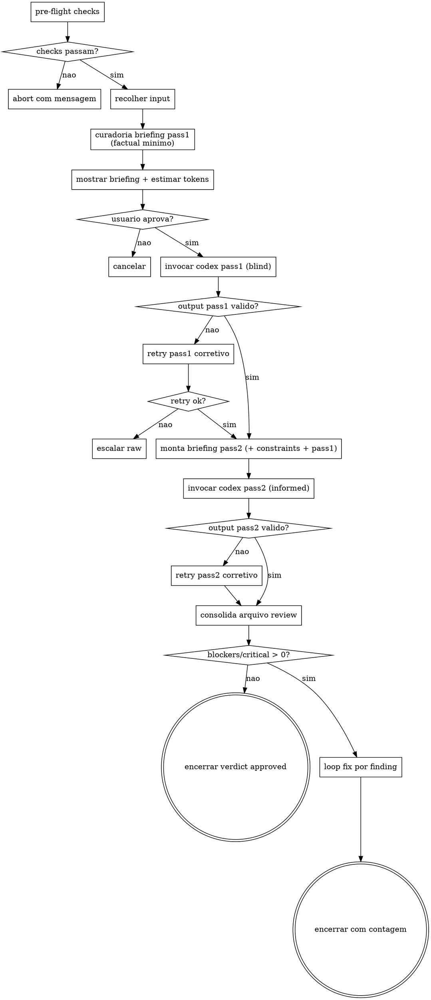

# Cross-Model Adversarial Review — Design

**Data:** 2026-05-16
**Status:** Aprovado para implementação
**Autor:** Henry Avila (com Claude Code)
**Skills criadas:** `review-plan-with-codex`, `review-code-with-codex`
**Módulo:** `codex-bridge`

---

## 1. Resumo executivo

Duas skills que disparam o **OpenAI Codex CLI** como reviewer adversarial em padrão **two-pass sealed envelope**, mitigando self-preference bias do Claude documentado em literatura 2024-2026. Output em markdown estruturado consumido pelo Claude para triagem e proposta de fixes. Infra de invocação compartilhada em módulo `codex-bridge`.

**Princípios centrais:**

1. **Cross-family review** (Claude → GPT) — papers de self-preference são conclusivos
2. **Briefing factual mínimo** — intent narrativo envenena o reviewer (-93pp em detecção, arXiv 2603.18740)
3. **Two-pass sealed envelope** — Pass 1 blind + Pass 2 com constraints, delta é sinal empírico de framing
4. **Markdown estruturado** — não JSON; consumidor primário é humano + Claude conversacional
5. **Codex resolve modelo** — não passa `--model`; CLI usa recommended atual

---

## 2. Motivação

### 2.1 Problema

O Claude tem self-preference bias documentado:

- arXiv 2410.21819 — GPT-4o e Claude 3.5 dão notas mais altas a outputs próprios e a outputs de mesma família
- arXiv 2508.06709 — family-bias mensurável e estatisticamente significativo
- arXiv 2509.26464 — self-preference em 20k queries; via API muitos modelos perdem auto-reconhecimento mas mantêm preferência implícita

Isso impacta diretamente reviews same-model (skill existente `review-plan-internal`): o Claude tende a aprovar próprios padrões. Para reviews críticos (planos arquiteturais, código em vias de merge), precisamos de **segunda opinião de família diferente**.

### 2.2 Solução proposta

Duas skills que invocam o **OpenAI Codex CLI** (família GPT) como reviewer externo:

- `review-plan-with-codex` — para revisão de plans/specs/design docs
- `review-code-with-codex` — para revisão de mudanças de código (diff/branch/PR)

### 2.3 Por que não uma skill só?

Os prompts adversariais são **fundamentalmente diferentes** entre plan e code:

| Aspecto | Plan review | Code review |
|---------|-------------|-------------|
| Mindset | Argumentar contra coverage/viabilidade | Atacar superfícies de código |
| Checklist | Contradições, gaps, ordering, ambiguidade | Race conditions, auth, data integrity, error handling |
| Severity "blocker" | Decisão arquitetural inviável | Production data loss, security breach |
| Ground truth | Baixa (argumentação) | Alta (teste prova) |

Misturar em uma skill com sub-modos cria prosa condicional (`if plan / if code`), violando lição capturada em `.ai/memory/feedback-prompts.md` (toda etapa obrigatória deve estar no checklist numerado, não diluída em condicionais).

**Decisão:** 2 skills + 1 módulo compartilhado para infra.

---

## 3. Não-objetivos (v1)

- **Não** substituir `review-plan-internal` — este complementa
- **Não** integração com PR # do GitHub (input é `git ref` por ora)
- **Não** MCP server mode
- **Não** CI integration documentada
- **Não** loop automático de re-review após fix (usuário re-invoca se quiser)
- **Não** notificação ativa de framing_delta alto (sinal fica no arquivo)

---

## 4. Arquitetura

### 4.1 Layout de arquivos

```
skills/
├── modules/codex-bridge/
│   └── module.yaml                           # declaração do módulo
├── shared/codex-bridge-assets/
│   ├── anti-framing-directive.md             # bloco fixo, reutilizado em ambos passes
│   ├── preflight-checks.md                   # checklist de pré-requisitos
│   ├── invocation-canonical.md               # comando shell canônico + flags + gotchas
│   ├── validation-checklist.md               # como validar output (regex + YAML)
│   ├── output-template-pass1.md              # template obrigatório do output blind
│   ├── output-template-pass2.md              # template obrigatório do output informed
│   ├── pass1-briefing-template-plan.md       # template do briefing pass 1 para plan
│   ├── pass1-briefing-template-code.md       # template do briefing pass 1 para code
│   ├── pass2-prompt-suffix.md                # bloco comum "your task in pass 2"
│   ├── review-file-template.md               # template do arquivo consolidado em reviews/
│   └── index-row-template.md                 # template da linha em INDEX.md
└── pt/core/
    ├── review-plan-with-codex.md             # consome assets via {{ASSETS_PATH}}
    └── review-code-with-codex.md
    (idem skills/en/core/)
```

### 4.2 Mudanças em código (`src/`)

| Arquivo | Mudança |
|---------|---------|
| `src/render.js` | Adicionar variável `{{ASSETS_PATH}}` resolvida em install time |
| `src/install.js` | Copiar `skills/shared/codex-bridge-assets/*` para destino; resolver `{{ASSETS_PATH}}` |
| `src/manifest.js` | Registrar `codex-bridge` como dep das duas skills (auto-instala junto) |
| `meta/skills.yaml` | Declarar as duas skills + módulo `codex-bridge` |

### 4.3 Persistência de reviews

```
.atomic-skills/reviews/
├── INDEX.md
└── YYYY-MM-DD-HHMM-<slug>.md  # um arquivo consolidado por review
```

Arquivo consolidado contém: frontmatter (metadata + counts blind/final + framing_delta) + Pass 1 output + Pass 2 output (com reconciliation) + briefings em `<details>` + section "Fixes applied" append-only.

---

## 5. Fluxo da skill

### 5.1 Checklist canônico (9 etapas)

1. **Pre-flight checks** (HARD-GATE)
   - `codex --version` ≥ `codex_min_version` (declarado em `module.yaml`)
   - `which codex` resolve
   - `git status --porcelain` vazio OU `--allow-dirty` (mitigação Codex bug #8404)
   - cwd é repo git OU `--skip-git-check`

2. **Recolher input**
   - `plan`: 1 path para arquivo `.md` existente
   - `code`: git ref válido (`main..HEAD`, branch, `pr:NNN` em v1.1)

3. **Curadoria do briefing Pass 1** (Claude executa, factual mínimo)
   - Identifica **só** constraints factuais externas (NÃO intent, NÃO memória curada)
   - Identifica non-goals e out-of-scope
   - Substitui placeholders no template `pass1-briefing-template-{plan,code}.md`
   - Grava em `/tmp/codex-briefing-pass1-<ts>.md`
   - Validação: `wc -c` do briefing (sem artefato) / 4 < 800 tokens — senão WARNING

4. **Confirmação do briefing** (HARD-GATE de consentimento)
   - Mostra: artefato, constraints, non-goals, out-of-scope, estimativa de tokens
   - Opções: `aprovar / editar / cancelar`

5. **Invocação Pass 1 — blind** (delega ao módulo)
   - Comando canônico do `invocation-canonical.md`
   - Captura output em `/tmp/codex-output-pass1-<ts>.md`

6. **Validação Pass 1**
   - Frontmatter parseável (`verdict`, `counts`, `pass: blind`)
   - Headers obrigatórios (`## Sumário`, `## Findings`)
   - Findings têm 5 campos (Evidence, Claim, Impact, Recommendation, Confidence)
   - Falha → 1 retry corretivo. Falha de novo → escala raw

7. **Monta briefing Pass 2 — informed**
   - Template = pass1 briefing + bloco de constraints factuais + output do pass 1 + `pass2-prompt-suffix.md`
   - Grava em `/tmp/codex-briefing-pass2-<ts>.md`

8. **Invocação Pass 2 — informed** (mesmo comando, novo briefing)
   - Captura output em `/tmp/codex-output-pass2-<ts>.md`
   - Validação adicional: header `## Pass 2 reconciliation` + sub-headers Dropped/Maintained/Emerged

9. **Persistência + triagem**
   - Consolida em `.atomic-skills/reviews/YYYY-MM-DD-HHMM-<slug>.md` usando `review-file-template.md`
   - Atualiza `INDEX.md`
   - Resumo de 1 linha (verdict, counts final, framing_delta)
   - Se `counts_final.blocker > 0 || counts_final.critical > 0`:
     - Para cada finding crítico: Claude propõe fix, usuário aplica/edita/pula
     - Append "Fixes applied" no arquivo de review

### 5.2 Diagrama de fluxo



---

## 6. Templates

### 6.1 Briefing Pass 1 (blind) — estrutura

```
1. Role + mission (persona adversarial)
2. Task (qual tipo de review)
3. Anti-framing directive (literal)
4. Non-goals (curtos, sem racional)
5. Out of scope for this review
6. Artifact to review (inline)
7. What to look for (attack surfaces — específico por skill)
8. Finding bar (4 perguntas obrigatórias)
9. Severity calibration + QUOTA (max 5 blocker+critical)
10. Output format (template markdown exato, copiável)
11. Forbidden behaviors (anti-sycophancy)
```

**Tamanho máximo (sem artefato): 800 tokens.** Acima disso → WARNING (degradação por context rot soma ao framing).

### 6.2 Briefing Pass 2 (informed) — adicionais

Briefing pass 1 + os blocos:

```
## External constraints (verifiable)
- <constraint 1, com forma de verificar>
- <constraint 2>

## Pass 1 (blind) findings
<full content of pass 1 output>

## Your task in this pass
Re-evaluate ALL findings from Pass 1 against the External Constraints above.
For EACH Pass 1 finding, decide: DROP / MAINTAIN / REFINE.
Then identify NEW findings that emerge ONLY because of these constraints.
Output: full findings list (final IDs) + reconciliation block.
```

### 6.3 Output template (ambos passes)

````markdown
---
verdict: <approve | approve_with_nits | needs_changes | reject>
counts: {blocker: N, critical: N, major: N, minor: N, nit: N}
reviewer: <model id>
pass: <blind | informed>
schema_version: "1.0"
---

## Sumário
<1-2 parágrafos, max 200 palavras — sem elogios>

## Findings

### F-001 [<severity>] <category> — <file>:<line_start>[-<line_end>]

**Evidence:**
```<lang>
<exact snippet>
```

**Claim:** <what fails>

**Impact:** <concrete consequence>

**Recommendation:** <specific, not "consider X">

**Confidence:** <high | medium | low>

---

### F-002 ... (repete)

## Questions (non-findings)
- <file>:<line> — <question>

## Out of scope
- <items noticed but skipped per Non-goals>
````

### 6.4 Pass 2 reconciliation block (OBRIGATÓRIO apenas no Pass 2)

```markdown
## Pass 2 reconciliation

### Dropped from blind pass
- F-001-blind [blocker] correctness — DROPPED: constraint X makes this intentional

### Maintained
- F-002-blind → F-001-final [critical] — same, no severity change

### Emerged (only after constraints revealed)
- F-005-final [blocker] correctness — emerged: violates constraint Y
```

### 6.5 Arquivo consolidado em `.atomic-skills/reviews/`

````markdown
---
date: 2026-05-16T14:30:00-03:00
topic: <slug>
artifact: <path>
skill: <review-plan-with-codex | review-code-with-codex>
reviewer: <model id>
codex_version: <X.Y.Z>
final_verdict: <verdict>
counts_final: {blocker: N, critical: N, major: N, minor: N, nit: N}
counts_blind: {blocker: N, critical: N, major: N, minor: N, nit: N}
framing_delta: {dropped: N, maintained: N, emerged: N}
schema_version: "1.0"
---

# Cross-Model Review — <topic>

## Pass 1 (blind)
<full content of pass 1 output>

## Pass 2 (informed)
<full content of pass 2 output, including reconciliation>

## Briefings used
<details>
<summary>Pass 1 briefing</summary>

```
<full pass 1 briefing>
```

</details>
<details>
<summary>Pass 2 briefing</summary>

```
<full pass 2 briefing>
```

</details>

## Fixes applied in this session
- F-001-final [blocker] <file>:<line> — applied: <description>
- F-003-final [major] — skipped: <reason>
````

### 6.6 INDEX.md

```markdown
# Reviews Index

| Date | Topic | Skill | Verdict | Counts (final) | Framing Δ |
|------|-------|-------|---------|----------------|-----------|
| 2026-05-16 14:30 | [cross-model-design](2026-05-16-1430-cross-model-design.md) | plan | needs_changes | 1B/1C/3M/1m | 2d/4=/1+ |
```

Notação: `1B/1C/3M/1m` = 1 blocker, 1 critical, 3 major, 1 minor. `2d/4=/1+` = 2 dropped, 4 maintained, 1 emerged.

---

## 7. Diferenças plan vs code

| Aspecto | review-plan-with-codex | review-code-with-codex |
|---------|------------------------|--------------------------|
| **Input** | path para `.md` | git ref (`main..HEAD`, branch) |
| **Role no briefing** | "Senior architect / spec reviewer" | "Senior security + correctness reviewer" |
| **Artifact** | conteúdo do `.md` inline | `git diff <ref>` + arquivos modificados |
| **Attack surfaces** | Contradições, coverage, dependências, ordering, ambiguidade, viabilidade | Race conditions, auth, data integrity, error handling, rollback, perf, test gaps, observability |
| **Categorias (enum)** | `coverage / viability / dependency / ambiguity / contradiction` | `correctness / security / race / perf / rollback / test-gap / observability` |
| **Severity blocker** | Decisão arquitetural inviável | Production data loss, security breach |
| **Estimativa custo** | ~6-16k tokens (2x para two-pass) | ~40-200k tokens (2x para two-pass) |

---

## 8. Decisões de design + evidência

### 8.1 Por que two-pass sealed envelope?

**Evidência:** Framing/anchoring bias é massivo em LLM review.

- arXiv 2603.18740 — framing "bug-free" no PR body derrubou detecção de CVEs em 16-93pp. GPT-4o-mini de 97.2% → 3.6%. Mesmo Claude Sonnet 4.5 (mais resistente) caiu 16.7pp.
- arXiv 2505.15392 — anchoring afeta 22-61% das questões em LLMs, comparável a humanos.
- Pattern ARIS (wanshuiyin/Auto-claude-code-research-in-sleep) implementa explicitamente: reviewer não recebe "prior review rounds, fix summaries, executor reasoning".

**Custo:** ~1.8x tokens, 2x latência. **Ganho:** detecção empírica de framing em todo run (delta blind→informed); sem necessidade de decisão "este review é crítico?" pelo usuário.

### 8.2 Por que briefing factual mínimo (< 800 tokens)?

**Evidência:**
- Paper 2603.18740: "Ignore framing, judge substance" restaura **94%** da detecção
- arXiv 2510.05381: accuracy cai 13-85% só pelo tamanho do contexto

**Decisão:** cortar intent narrativo, memória curada, identificação de autoria. Manter só constraints externas verificáveis + non-goals + out-of-scope.

### 8.3 Por que markdown estruturado em vez de JSON Schema?

**Evidência:** Pesquisa inicial recomendou JSON Schema via `--output-schema` do Codex CLI, mas otimizava para "pipeline CI alimentando dashboard". Para skill interativa:

- Findings com snippets de código ficam ilegíveis em JSON (escape de `"`, `\n`)
- Claude lê markdown nativamente, sem parse
- JSON inválido quebra tudo; markdown degrada gracioso
- Convenção existente do projeto: `review-plan-internal` retorna tabela markdown
- Edição manual e diff em git são triviais em MD, impraticáveis em JSON

**Frontmatter YAML** dá o único parse programático que importa (`verdict`, `counts`, `framing_delta`).

Memória capturada: `.ai/memory/feedback-formato-retorno.md`.

### 8.4 Por que não passar `--model` ao Codex?

**Evidência:** `codex debug models` mostra catálogo dinâmico; bundled default da CLI segue versão instalada; `codex update` atualiza tudo. Manter `models.yaml` no nosso repo duplicaria essa responsabilidade.

**Decisão:**
- Default: NÃO passa `--model` — Codex usa recommended dele
- `--ask-model`: chama `codex debug models` para listar opções reais
- Override via flag explícita aceito
- `review-code-with-codex` pode opcionalmente preferir `gpt-5.3-codex` por default (code-specialized)

### 8.5 Por que reconciliação feita pelo Codex (no Pass 2) em vez do Claude?

**Decisão:** Codex já viu os dois outputs no Pass 2; reconciliar é trivial para ele. Claude faria fuzzy matching de strings (frágil) ou embedding (complexo). Schema do Pass 2 inclui bloco `## Pass 2 reconciliation` obrigatório com Dropped/Maintained/Emerged.

### 8.6 Por que separar em 2 skills + módulo?

**Evidência:**
- Princípio do projeto: "Small. Specific. Capable."
- Precedente: `review-plan-internal` e `review-plan-vs-artifacts` já são duas skills
- Lição capturada (`feedback-prompts.md`): toda etapa obrigatória vai no checklist, não em condicionais `if plan/if code`

**Trade-off aceito:** 2x arquivos de tradução (PT+EN×2 = 4). Mitigação: prompts pequenos (~80-120 linhas cada).

---

## 9. Riscos e mitigações

| Risco | Probabilidade | Impacto | Mitigação |
|-------|---------------|---------|-----------|
| Codex bug #8404: working tree dirty gera findings halucinados | Alta | Médio | HARD-GATE: `git status --porcelain` vazio OU `--allow-dirty` explícito |
| Codex `exec` trava com stdin em subprocess | Alta | Alto | `</dev/null` sempre no comando canônico; `timeout 600` externo |
| Output malformado quebra parser | Média | Médio | 1 retry corretivo; escala raw em segunda falha |
| Framing residual mesmo com briefing factual | Média | Médio | Two-pass detecta empiricamente; delta exposto no arquivo de review |
| Custo de tokens descontrolado em diff grande | Média | Médio | `wc -c` antes de invocar; > 100k tokens (sem artefato) exige confirmação extra |
| Usuário não tem `codex` instalado | Alta | Baixo | Pre-flight check com mensagem clara de instalação |
| OpenAI lança modelo novo e Codex não vê | Baixa | Baixo | Sugere `codex update` se CLI > 90 dias antiga |
| Reviewer aprova com baixa contagem por eco-chamber | Baixa | Médio | Quota "max 5 blocker+critical" força recalibração; finding bar de 4 perguntas obrigatórias |

---

## 10. Critérios de aceitação

A v1 está pronta quando:

1. ✅ `npm test` passa (testes unitários novos + estendidos)
2. ✅ `atomic-skills install --ide codex` em projeto vazio cria estrutura corretamente
3. ✅ Em projeto teste, invocar `review-plan-with-codex` em plan conhecido (com gaps plantados) detecta os gaps
4. ✅ Two-pass produz `framing_delta` não-zero em pelo menos 1 dos 3 fixtures de teste
5. ✅ Anti-framing directive presente no briefing renderizado (regex check)
6. ✅ README + README.pt-BR atualizados com seção "Cross-Model Review"
7. ✅ `docs/kb/cross-model-review-design.md` criado documentando princípios
8. ✅ Versionamento bumped para `1.8.0` (semver minor)

---

## 11. Plano de implementação (alto nível)

Fases para o spec → plan de implementação:

1. **Fase 1 — Infraestrutura**: módulo `codex-bridge` (`module.yaml` + assets); mudanças em `src/render.js`, `src/install.js`, `src/manifest.js`; testes correspondentes
2. **Fase 2 — Skill review-plan-with-codex**: PT + EN; templates de briefing plan; fixture de teste com plan defeituoso
3. **Fase 3 — Skill review-code-with-codex**: PT + EN; templates de briefing code; fixture de teste com diff defeituoso
4. **Fase 4 — Documentação**: README updates, KB doc, CHANGELOG
5. **Fase 5 — Integração**: teste end-to-end opt-in (`CODEX_INTEGRATION=1`); validação manual com Codex real
6. **Fase 6 — Release**: bump semver, tag, npm publish via CI

Detalhes de cada fase vão no plano de implementação (próximo artefato).

---

## 12. Memórias capturadas durante o design

Aprendizados durável que viraram memos persistentes:

- `.ai/memory/feedback-formato-retorno.md` — Markdown estruturado > JSON para skills interativas
- `.ai/memory/feedback-framing-llm-judge.md` — Em LLM-as-judge, cortar intent narrativo (envenena em -93pp)

Ambos referenciados em `.ai/memory/MEMORY.md`.

---

## 13. Referências

### Papers (self-preference + framing bias)
- arXiv 2410.21819 — Self-Preference Bias in LLM-as-a-Judge (Wataoka et al.)
- arXiv 2508.06709 — Play Favorites: family-bias measurement
- arXiv 2509.26464 — Extreme Self-Preference in Language Models
- arXiv 2603.18740 — Measuring and Exploiting Contextual Bias in LLM-Assisted Security Code Review
- arXiv 2505.15392 — Understanding the Anchoring Effect of LLMs (ICLR HCAIR 2026)
- arXiv 2510.05381 — Context Length Alone Hurts LLM Performance
- arXiv 2509.13400 — Justice in Judgment: Hidden Bias in LLM-assisted Peer Reviews
- arXiv 2506.09443 — LLMs Cannot Reliably Judge (Yet?)

### Codex CLI
- developers.openai.com/codex/cli/reference — Command line options
- developers.openai.com/codex/noninteractive — Non-interactive mode
- developers.openai.com/codex/models — Modelos disponíveis
- github.com/openai/codex/issues/20919 — stdin hang em non-TTY
- github.com/openai/codex/issues/8404 — base branch review halucinations

### Patterns de cross-model review
- github.com/openai/codex-plugin-cc — Plugin oficial Codex para Claude Code
- github.com/dementev-dev/adversarial-review — Claude/Codex iterativo
- github.com/zscole/adversarial-spec — N-model consensus
- github.com/wanshuiyin/Auto-claude-code-research-in-sleep — ARIS (Reviewer Independence Protocol)
- anthropic.com/engineering/effective-context-engineering-for-ai-agents

### Skills existentes do projeto
- `skills/pt/core/review-plan-internal.md` — same-model adversarial review (complementado por este design)
- `skills/pt/core/review-plan-vs-artifacts.md` — cross-document review (precedente de "2 skills com mesmo input")
- `.ai/memory/feedback-prompts.md` — Checklists > prosa, ferramenta nomeada, prova exigida
- `docs/kb/estrutura-canonica-commands.md` — Template canônico de skills
