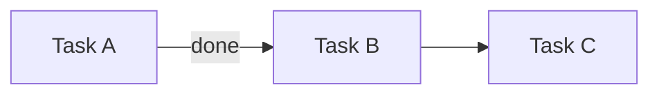

Maintain canonical Plan / Initiative / Task state in `.atomic-skills/` — read, create, update, display, migrate.

This skill implements a 3-level model that matches `@henryavila/aideck`:

- **Plan** — multi-phase project with narrative, principles, glossary, phases, exit gates (`.atomic-skills/plans/<slug>.md`)
- **Initiative** — one phase of a plan, OR a standalone unit of work (`.atomic-skills/initiatives/<slug>.md`)
- **Task** — atomic action inside an initiative (frontmatter `tasks[]`)

Standalone initiatives (no `parentPlan`) coexist with plan-anchored initiatives. Plans are optional; a project may run with only initiatives.

State files conform to JSON Schemas in `meta/schemas/` (`plan.schema.json`, `initiative.schema.json`, `common.schema.json`). Validate via `npm run validate-state`. Canonical `schemaVersion` is `'0.1'`.

## Iron Law

NO IMPLEMENTATION WITHOUT ANCHORED INITIATIVE.

Every code-modifying session must be anchored to an active initiative in `.atomic-skills/initiatives/<slug>.md` (standalone or under an active plan), or the user must explicitly declare "ad-hoc".

## Initial detection

Run with {{BASH_TOOL}}:
- `test -d .atomic-skills/` — if absent, enter setup mode
- If present, read `.atomic-skills/PROJECT-STATUS.md`:
  - Determine the **active Plan** (if any) and its `currentPhase`
  - Determine the **active Initiative** (phase initiative of the active plan, OR a standalone initiative)
  - If the current branch matches no active initiative → run the disambiguation flow

## Modes

See sections below per {{ARG_VAR}}.

## Setup (when `.atomic-skills/` does not exist)

Announce: "I will configure project-status in this repo."

### 1. Detect environment
- `test -d .claude/` → Claude Code
- `test -d .cursor/` → Cursor
- `test -d .gemini/` → Gemini CLI
- Otherwise → generic IDE; skip step 5

### 2. Verify/create CLAUDE.md
- If CLAUDE.md is absent: ask "Create minimal CLAUDE.md with hard-gate? (y/n)" — if yes, create with a title + hard-gate template
- If CLAUDE.md exists: prepare to inject block between markers

### 3. Inject hard-gate into CLAUDE.md (idempotent)
Read `skills/shared/project-status-assets/CLAUDE.md-gate.template.md` (assets packaged with the skill).
Check if markers `<!-- atomic-skills:status-gate:start -->` already exist:
- If yes and content is identical: skip
- If yes and content differs: show diff, ask if updating
- If not: append to end of CLAUDE.md

### 4. AGENTS.md redirect
- If AGENTS.md absent: create from `skills/shared/project-status-assets/AGENTS.md.template.md`
- If AGENTS.md exists and references CLAUDE.md: skip
- If AGENTS.md exists without reference: show suggested diff, ask confirmation (do not force)

### 5. Install hooks (Claude Code only)
Present Structured Options:
> What enforcement level?
> (a) Passive — hard-gate in CLAUDE.md only, no hooks
> (b) Soft (recommended) — hard-gate + SessionStart hook + PreToolUse provenance gate (dry-run)
> (c) Strict — hard-gate + SessionStart + Stop hook + PreToolUse provenance gate (all dry-run 7d before real strict)

For (b) and (c): copy `session-start.sh`, `stop.sh`, and `pre-write.sh` to `.atomic-skills/status/hooks/`, register them in `.claude/settings.local.json` under `SessionStart`, `Stop`, and `PreToolUse` (with `matcher: "Edit|Write|MultiEdit"`) respectively.

For (b): copy `config.json` with `strict_mode: false`, `emergent_strict_mode: false`, and `dry_run_started: $(date -I)`.
For (c): same `config.json` shape — both strict knobs default false during the 7-day dry-run window.

The `pre-write.sh` gate intercepts direct Edits to `.atomic-skills/initiatives/*.md` and `plans/*.md` that add entries to `tasks[]` or `phases[]` without a `provenance:` field. Use the documented `new-task` / `new-phase` / `split-phase` / `emerge --target` commands (they set provenance automatically) instead. Bypass for 24h with `touch .atomic-skills/status/SKIP-EMERGENT`.

### 6. Create structure

Use {{BASH_TOOL}}:
```bash
mkdir -p .atomic-skills/plans/archive
mkdir -p .atomic-skills/initiatives/archive
mkdir -p .atomic-skills/status/hooks
```

Copy `PROJECT-STATUS.md.template.md` to `.atomic-skills/PROJECT-STATUS.md`, replacing `REPLACE_ISO_TIMESTAMP` with the current timestamp.

### 7. Update .gitignore
Append (if not present):
```
.atomic-skills/status/stop.log
.atomic-skills/status/drift.log
.atomic-skills/status/emergent-drift.log
.atomic-skills/status/SKIP
.atomic-skills/status/SKIP-EMERGENT
.atomic-skills/plans/*.rendered.md
.atomic-skills/initiatives/*.rendered.md
.atomic-skills/bootstrap-drafts/
.atomic-skills/status/bootstrap.json
```

### 8. Report
List everything created and give rollback instructions (`git status` + `git restore`).

Also ask: "Scan repo to discover in-flight initiatives? (y/N)". If yes, invoke the `bootstrap` flow described below.

## View modes

### Default (no args, structure exists)

If there is an active initiative whose `branch:` matches `git rev-parse --abbrev-ref HEAD`:
- Read `.atomic-skills/initiatives/<slug>.md`, parse frontmatter YAML
- Render in terminal:
  1. Header: `▸ <slug> · <status> · depth <N> · updated <human-timestamp>`
     - If the initiative has `parentPlan` + `phaseId`, prepend: `<plan-slug>/<phaseId> ▸ <slug>`
  2. STACK (tree with box-drawing): each frame from `stack:` indented; mark last with ` ◉ HERE`
  3. TASKS (table): ID | Title | State-with-icon | Updated
  4. PARKED + EMERGED side by side (2 columns)
  5. NEXT: `<nextAction>` from frontmatter
  6. **CODEX REVIEW** line: see `## Codex review tracking` below — this single line tells the user whether the work-in-progress has been adversarially reviewed since the last meaningful change, and surfaces the `review-due` command if not.

Unicode icons:
- `✓` done, `◉` active, `·` pending, `⊘` blocked, `⌂` parked, `⇥` emerged
- `◉ HERE` marks the active frame
- `←` or `waits X` for dependencies

ANSI colors (respecting `$NO_COLOR`):
- done → green, active/HERE → cyan, pending/— → gray, blocked → yellow, parked → magenta

### `--list`

Two tables: active Plans, then active standalone Initiatives.

```
ACTIVE PLANS
┌──────────────┬─────────┬───────────────┬──────────────┬─────────────┐
│ Slug         │ Status  │ Current Phase │ Branch       │ Started     │
├──────────────┼─────────┼───────────────┼──────────────┼─────────────┤
│ <plan-slug>  │ active  │ F0            │ <branch>     │ YYYY-MM-DD  │
└──────────────┴─────────┴───────────────┴──────────────┴─────────────┘

ACTIVE INITIATIVES (standalone)
┌────────────────┬─────────┬─────────────┬──────────────┬────────────────────────┐
│ Slug           │ Status  │ Started     │ Branch       │ Next Action            │
├────────────────┼─────────┼─────────────┼──────────────┼────────────────────────┤
│ <slug>         │ active  │ YYYY-MM-DD  │ <branch>     │ <nextAction>           │
└────────────────┴─────────┴─────────────┴──────────────┴────────────────────────┘
```

### `--plan [<slug>]`

Bird's-eye view of an active plan (or the only active plan if no slug given). Render:
1. Header: `<plan-slug> · v<version> · <status> · currentPhase: <id>`
2. PRINCIPLES (numbered list, title only)
3. PHASES (table): ID | Title | Status (icon) | SubPhases | Depends On | Exit Gate Summary
4. INTER-PHASE GATES (if present): "from → to: <criteria>"
5. REFERENCES (count + first 3)

### `--phase [<phase-id>]`

Detail view of the current phase of the active plan (or the given phase id). Render:
1. Header: `<plan-slug>/<phaseId> — <title> · <status>`
2. GOAL
3. EXIT GATE: criteria with status icons; render verifier kind summary
4. INITIATIVE for this phase (if exists): tasks summary inline
5. CROSS-TASK REFS impacting this phase

### `--stack`

Only the STACK section of the active initiative. 3-8 lines. For quick mid-session checks.

### `--archived`

Last 10 entries from `.atomic-skills/plans/archive/` AND `.atomic-skills/initiatives/archive/`, tabular, sorted by archived date desc.

## Schema reference (frontmatter fields)

The skill conforms to the JSON Schemas in `meta/schemas/`. Below is a quick reference; the schema files are authoritative.

### Plan (`.atomic-skills/plans/<slug>.md` frontmatter)

Required: `schemaVersion: '0.1'`, `slug`, `title`, `version`, `status`, `started`, `lastUpdated`, `currentPhase` (string|null), `parallelismAllowed` (bool), `phases[]`.

Optional: `branch`, `principles[]`, `glossary[]`, `tracks[]`, `interPhaseGates[]`, `supersedes`, `references[]`, `whatStaysValid[]`.

Markdown body: `narrative` — the long-form context, motivation, full decomposition. Not in frontmatter.

`PhaseDescriptor`: `id`, `slug`, `title`, `goal`, `dependsOn[]`, `subPhaseCount`, `exitGate {summary, criteria[]}`, `status`. Optional: `parallelWith[]`, `track`, `audience`, `externalImports[]`, `exitGateType` (`standard`/`ui-gate`/`custom`).

`ExitCriterion`: `id`, `description`, `status` (`pending`/`met`/`deferred`). Optional: `verifier`, `metAt`, `deferredReason`.

`ExitCriterionVerifier` (oneOf):
- `{ kind: shell, command, expectExitCode? }`
- `{ kind: query, sql, expectRowCount? }`
- `{ kind: test, runner, pattern }`
- `{ kind: manual, description }`

### Initiative (`.atomic-skills/initiatives/<slug>.md` frontmatter)

Required: `schemaVersion: '0.1'`, `slug`, `title`, `goal`, `status`, `branch` (string|null), `started`, `lastUpdated`, `nextAction` (string|null), `exitGates[]`, `stack[]`, `tasks[]`, `parked[]`, `emerged[]`.

Optional: `parentPlan`, `phaseId`, `audience`, `scope {paths[]}`, `externalImports[]`, `references[]`, `crossTaskRefs[]`.

Markdown body: `body` — additional rationale, decisions, gotchas. Not in frontmatter.

`Task`: `id`, `title`, `status` (`pending`/`active`/`done`/`blocked`), `lastUpdated`. Optional: `description`, `closedAt`, `blockedBy[]`, `outputs[]`, `tags[]`, `resourceCounts`, `verifier`.

`StackFrame`: `id` (int ≥ 1), `title`, `type` (`task`/`research`/`validation`/`discussion`), `openedAt`.

`CrossTaskRef`: `fromTaskId`, `toInitiativeSlug`, `toTaskId`, `relation` (`depends_on`/`extends`/`unblocks`/`references`). Optional: `note`.

## Parsing frontmatter YAML

You (LLM) can parse frontmatter YAML directly — it is plain text with predictable structure. For edge cases (nested quotes, multi-line, complex lists), invoke the `yaml` npm package via `node -e "import('yaml').then(...)"`.

## Mutation modes

In each case, update the target frontmatter YAML and bump `lastUpdated:` to now (`date -u +%Y-%m-%dT%H:%M:%SZ`).

Quick map (mutations that exist + their section anchor):

| Command | What it does |
|---------|--------------|
| `new-plan <slug>` | Bootstrap a new Plan via the `project-plan` skill |
| `new <slug>` | Create a new Initiative (standalone or under active plan) |
| `push <description>` | Push a new stack frame (lateral expansion) |
| `pop [--resolve\|--park\|--emerge]` | Pop top frame with destination |
| `park <description>` | Add a parked item |
| `emerge <description>` | Add an emerged finding |
| `promote <title-or-idx>` | Promote a parked item to a real task |
| `done <task-id>` | Mark task done; auto-detect last-task-done |
| `phase-done` | Verify exit gates, advance to next phase (now prompts codex review) |
| `phase-reopen` | Reverse of phase-done |
| `archive [<slug>]` | Move plan/initiative to archive/ |
| `switch <slug>` | Pause current active, set target as active |
| `migrate <slug>` | Migrate a legacy file to schema 0.1 |
| `detect-scope` | Suggest scope.paths from recent git activity |
| `review-due` | Cross-model codex review against the diff since last review |
| `new-task [--target <phaseId>] "<title>"` | Add a task to current OR specified initiative (records provenance) |
| `new-phase <id> "<title>" --after <other-id>` | Insert a new phase into the active plan + materialize its initiative |
| `split-phase <id>` | Split an over-sized phase into two sub-phases (archives the original) |
| `emerge --target <phaseId> "<title>"` | Cross-phase emergence (adds to target phase's initiative, not the active one) |
| `scope-creep` | On-demand drift report (phases grew, scope expansion %, parked zombies) |

**Pre-mutation migration check** — every time you load an existing initiative or plan for mutation:
1. Parse its frontmatter.
2. If `schemaVersion` is absent or missing, this is a **legacy file**. STOP and prompt the user:
   > "This file uses the legacy (pre-0.1) format. Migration is required to save. Migrate now?
   > Choices:
   >   (s) standalone — no parentPlan
   >   (p) under existing plan — pick from list
   >   (n) cancel — abort the requested mutation"
3. On `(s)` or `(p)`: call `src/migrate.js`:`migrateLegacyInitiative(legacy, { parentPlan, phaseId })`. Write the result back. Continue with the user's original mutation.
4. On `(n)`: abort with message "Mutation cancelled — file remains in legacy format. Re-run when ready to migrate."

The pre-mutation check is the **only** way legacy files are touched. The skill never silently writes legacy-shape YAML.

### `new-plan <slug>`

1. Validate slug: regex `^[a-z][a-z0-9-]{1,63}$`. Reject if invalid.
2. Check for duplicate: if `.atomic-skills/plans/<slug>.md` exists, abort with a suggested alt-slug.
3. Ask the user (if not obvious from context):
   - Plan title
   - Initial phase id (default `F0`) and phase title
   - Associated branch (optional)
   - Whether to invoke an external planner (`superpowers:brainstorm` → `superpowers:write-execution-plan`) — only offered if superpowers is installed; out of scope for v0.1 if absent.
4. Copy `skills/shared/project-status-assets/plan.template.md` to `.atomic-skills/plans/<slug>.md`, substituting `REPLACE_*` markers.
5. Append row to "Active Plans" table in `.atomic-skills/PROJECT-STATUS.md`.
6. Offer: "Create the initial phase initiative now? (`new <slug>-<phase-id>` under this plan)" — if yes, chain to `new` with `parentPlan` + `phaseId` pre-set.
7. Report to user with the created plan path.

### `new <slug>`

1. Validate slug: regex `^[a-z][a-z0-9-]{1,63}$`. Reject with a clear message if invalid.
2. Check for duplicate: if `.atomic-skills/initiatives/<slug>.md` exists, abort with a name suggestion.
3. Ask the user (if not obvious from context):
   - Is this initiative **standalone** or part of an **active plan**? If active plans exist, list them.
   - If part of a plan: which `phaseId` does it represent? (suggest the plan's `currentPhase`).
   - Initial title and goal (one short imperative sentence each).
   - Associated branch (auto-fills with `git branch --show-current` if none provided).
   - Optional `audience` (e.g., "Developer", "Admin user").
4. Copy `skills/shared/project-status-assets/initiative.template.md` to `.atomic-skills/initiatives/<slug>.md`, substituting `REPLACE_*` markers.
5. Handle the **plan-membership-block** in the template:
   - Standalone: delete the entire block including both `# === ... ===` sentinel lines.
   - In-plan: delete the two sentinel comment lines but fill `REPLACE_PARENT_PLAN_SLUG` and `REPLACE_PHASE_ID`.
6. Offer to detect scope automatically: invoke `detect-scope` (see below); on user accept, write the suggested `scope.paths` into the new initiative.
7. Append row to either "Active Initiatives (standalone)" or under the relevant plan in `.atomic-skills/PROJECT-STATUS.md`.
8. Report to user with the created path.

### `push <description>`

1. Identify active initiative (via branch match or explicit `--slug` arg).
2. Read `stack:` from frontmatter.
3. Append new frame: `{id: <max_id+1>, title: "<description>", type: <inferred>, openedAt: <now>}`.
4. Save.
5. Announce: "Frame <N> pushed: <description>. Current depth: <N>."
6. If depth > `max_stack_depth_warning` (from config.json), warn: "Stack is deep — is this still the same initiative?"

Inferred types from verb: "research" → research; "test" → validation; "discuss" → discussion; otherwise → task.

### `pop [--resolve|--park|--emerge]`

0. If `stack:` is empty, abort with message: "Stack empty — nothing to pop."
1. Identify top frame of the stack.
2. Destination:
   - `--resolve` (default): remove from stack, add note in Done if it was a task
   - `--park`: move content to `parked:` (same initiative)
   - `--emerge`: move to `emerged:` (candidate for new initiative)
3. Remove frame from stack.
4. Announce: "Frame <N> popped to <destination>. Current frame: <new top>."
5. Update `lastUpdated` and save.

### `park <description>`

1. Identify active initiative.
2. Append to `parked:`: `{title: "<description>", surfacedAt: <now>, fromFrame: <current-top-id>}`.
3. Save.

### `emerge <description>`

1. Identify active initiative.
2. Append to `emerged:`: `{title: "<description>", surfacedAt: <now>, promoted: false}`.
3. Save.
4. Offer: "Create new initiative now for '<description>'? (`new <slug>`)" — if yes, call `new` handler.

### `promote <parking-item-title-or-index>`

1. Locate item in `parked:`.
2. Generate next task ID (`T-<NNN+1>` based on the highest existing).
3. Add to `tasks:` (array): `{id: '<id>', title: <parking title>, status: pending, lastUpdated: <now>}`.
4. Remove item from `parked:`.
5. Announce new task ID.

### `done <task-id>`

1. Locate task in `tasks:` (array). Find the entry where `id === <task-id>`.
2. Change `status: done`, set `closedAt: <now>`, refresh `lastUpdated: <now>`.
3. Save the initiative file.
4. **Auto-transition detection**: count remaining tasks with `status` in `{pending, active, blocked}`. If zero:
   - When the initiative has a `parentPlan`: announce "Last task of `<parentPlan>/<phaseId>` closed. Run `phase-done` to verify exit gates and advance the plan?". The next session's SessionStart hook also surfaces a 🔔 phase-transition reminder via the active-initiative pending-task count.
   - When the initiative is standalone: announce "All tasks of `<slug>` closed. Run `archive <slug>` or open a new initiative?".
   - Do NOT automatically run `phase-done` or `archive` — the user opts in (intrusive-actions rule).
5. Announce the task closure.

### `phase-done`

Invoked when the active initiative is the phase initiative of an active plan AND all its tasks are closed. Iterates the phase's exit gate criteria, archives the phase initiative, advances `currentPhase` per the dependency graph, and seeds the next phase's initiative.

1. Load the active initiative. Verify it has `parentPlan` + `phaseId` set. Else abort.
2. Load the parent plan from `.atomic-skills/plans/<parentPlan>.md`. Locate the phase by `phaseId`. Read `phase.exitGate.criteria` AND `initiative.exitGates` (combine; phase-level criteria are authoritative for the gate).
3. For each criterion (status === `pending`) → apply the **Verifier execution patterns** below.
4. After iterating: report status summary. Continue to advance only when every criterion is `met` OR was explicitly `deferred` with a `deferredReason`.
5. If any criterion is still `pending` after iteration: ask "Some gates remain pending. Mark phase done anyway? (y/N)". On `n`, leave initiative in `active` state and stop. On `y`, document the override (set `deferredReason` on the remaining criteria) and proceed to step 6.
6. **Advance the plan** — call `src/transition.js`:`proposeAdvance(plan, phaseId)` to decide what's next. The function returns one of three shapes:
   - `{ kind: 'plan-done', eligible: [] }` — no more eligible phases. Offer to mark the plan itself `status: done` and `archive` it.
   - `{ kind: 'single', next: '<id>', alternatives: [...] }` — propose "Phase `<id>` done. Advance `currentPhase` to `<next>`? (y/N)". List `alternatives` so the user can override before accepting.
   - `{ kind: 'parallel-choice', eligible: [...] }` — when the plan has `parallelismAllowed: true`, ask "Which of `<eligible...>` should be activated now? Select one or more (or `none`)".
   Before presenting any of the above, call `src/transition.js`:`unknownDeps(plan)`. If it returns non-empty, surface the typos to the user and abort the advance — the dependency graph is broken.
7. On the user's accept of an advance:
   - Update the parent plan's matching phase: `status: done`, `lastUpdated: <now>`. Set the plan's `currentPhase` to the picked next phase (or to the first of multiple in parallel mode).
   - Run `archive <slug>` on the just-closed initiative so its file moves to `initiatives/archive/`.
   - For each newly-active phase id, propose `new <plan-slug>-<phase-id-lower>-<phase-title-kebab>` to materialize the next initiative. The `new` flow already seeds the initiative's first stack frame from `initiative.template.md`.
   - Save the plan + PROJECT-STATUS.md.
8. On user decline (or `plan-done` accept without `currentPhase` change): set the parent plan's phase `status: done` and stop without seeding a successor.

### Verifier execution patterns (`verify_exit_gate` workflow)

Applies to **each** `ExitCriterion` with `status === 'pending'` (or any criterion the user asks to re-verify). Used by `phase-done`, by per-task `verifier:` fields, and by ad-hoc verification from the user.

The output of every successful (or attempted) verification is stamped into the criterion's optional `evidence` block. The shape is:

```yaml
evidence:
  verifierKind: shell | query | test | manual
  verifiedAt: <ISO8601>
  passed: true | false
  exitCode: <integer>      # shell only
  rowCount: <integer>      # query only
  outputSummary: "<≤500 chars excerpt or user note>"
```

`evidence` is REQUIRED to set `status: met` when a verifier is present. Without `evidence`, the criterion stays `pending` (manual override → `deferred` with `deferredReason`).

#### `kind: shell`

1. Present the criterion `id` + `description` + the full `command` to the user.
2. Ask: "Run this verifier? (y/N)" — intrusive-actions rule applies.
3. On `y`: execute with {{BASH_TOOL}}, capture exit code AND a tail of stdout (≤500 chars). Compare exit code with `expectExitCode` (default `0`).
4. Write `evidence`:
   - `verifierKind: shell`, `verifiedAt: <now>`
   - `exitCode: <observed>`, `passed: <bool>`
   - `outputSummary: <stdout tail>`
5. If `passed === true`: set `status: met`, `metAt: <now>`.
6. If `passed === false`: ask "Mark `deferred` with a reason, retry, or leave pending?".
   - On `deferred`: keep the `evidence` block (so the failed run is recorded), set `status: deferred`, capture `deferredReason`.
   - On retry: loop back to step 3.
   - On leave-pending: keep `evidence` (records the failed attempt) but leave `status: pending`.

#### `kind: manual`

1. Present the criterion `id` + `description` + the verifier's `description`.
2. Ask: "Confirm this criterion is met? (y/n/defer)".
3. Write `evidence`:
   - `verifierKind: manual`, `verifiedAt: <now>`
   - `passed: <true if y else false>`
   - `outputSummary: <user's note, or empty>`
4. On `y`: set `status: met`, `metAt: <now>`.
5. On `n`: ask "Mark `deferred` (with reason) or leave `pending`?". Apply.
6. On `defer`: capture `deferredReason`, set `status: deferred`.

#### `kind: query` (v0.1: stubbed execution)

The schema is declared; the skill does NOT auto-run SQL in v0.1 (no DB conn assumed).

1. Present the criterion `id` + `description` + `sql` + `expectRowCount` (if any).
2. Ask: "Run this query externally and report the row count, or skip?".
3. If user provides a row count:
   - Write `evidence`:
     - `verifierKind: query`, `verifiedAt: <now>`
     - `rowCount: <reported>`, `passed: <rowCount === expectRowCount>`
     - `outputSummary: <user's note>`
   - Set `status: met` / `deferred` based on `passed` and user confirmation.
4. If user skips: leave `status: pending`, no `evidence` written.

#### `kind: test` (v0.1: stubbed execution)

The schema is declared; the skill does NOT auto-run test runners in v0.1.

1. Present the criterion `id` + `description` + `runner` + `pattern`.
2. Ask: "Run the test pattern (e.g., `<runner> <pattern>`) externally and report pass/fail, or skip?".
3. If user provides a result:
   - Write `evidence`:
     - `verifierKind: test`, `verifiedAt: <now>`
     - `passed: <bool>`, `outputSummary: <user's note>`
   - Set `status: met` / `deferred` per user.
4. If user skips: leave `status: pending`, no `evidence` written.

#### No verifier present

Treat as `kind: manual` with an empty `description`. Ask the user for explicit ack before marking `met`.

#### Per-task verifiers (`tasks[].verifier`)

When closing a task (`done <task-id>`) whose entry has a non-empty `verifier:`, apply the same workflow before marking the task done. Store the result inline on the task — task-level evidence is NOT in the v0.1 Task schema, so for now record it as a one-line note in the task's `description` (`"verified <verifierKind> at <ISO>: passed=<bool>"`) and stamp `closedAt`. A future v0.2 may extend the Task schema with its own `evidence` block.

### `phase-reopen`

Reverse of `phase-done`. Used when a closed phase needs more work (regression, scope expansion).

1. Identify the target phase (by `phaseId` arg or by reading the parent plan's last-done phase).
2. Confirm with user: "Reopen phase `<id>`? This sets initiative status back to active and clears `metAt` on all criteria."
3. On accept: set initiative `status: active`; set every `exitGate[].status` and `phases[<id>].exitGate.criteria[].status` to `pending`; clear `metAt`.
4. If the plan had advanced past this phase, leave `currentPhase` unchanged (user decides whether to re-route).
5. Save. Update PROJECT-STATUS.md.

### `detect-scope`

Wrap `scripts/detect-scope.js` to suggest a `scope.paths` value based on recent git activity.

1. Run `npm run detect-scope -- --json --branch=<active-branch> --limit=20` via {{BASH_TOOL}}.
2. Parse the JSON output. Present the top groupings to the user as a checklist.
3. On user accept: write the accepted globs into the active initiative's `scope.paths`. Save.
4. If the initiative already had `scope.paths`: merge (union) with the new suggestions; ask user before overwriting any existing entry.

### `migrate <slug>`

Explicit migration trigger for a legacy initiative the user wants to migrate ahead of a mutation.

1. Load `.atomic-skills/initiatives/<slug>.md`. Parse frontmatter.
2. If `schemaVersion === '0.1'`, announce "Already migrated" and exit.
3. Apply the **pre-mutation migration check** flow described above (standalone vs in-plan choice).
4. Run `src/migrate.js`:`migrateLegacyInitiative(legacy, { parentPlan, phaseId })`. Write the result back.
5. Report: "Migrated `<slug>` to schemaVersion 0.1. Field mapping summary: ..." (show the diff at a high level).
6. Optionally run `npm run validate-state -- .atomic-skills/initiatives/<slug>.md` to confirm.

### `archive [<slug>]`

Works on both plans and initiatives. If `<slug>` matches `.atomic-skills/plans/<slug>.md`, archive the plan **and propagate** to its child initiatives.

1. Identify target (arg or active initiative). Detect kind by file location.
2. **Plan archival**:
   - Set the plan's `status: archived`.
   - For every initiative with `parentPlan === <slug>` and `status` in {`active`, `paused`, `pending`}: set its `status: archived`, move file to `initiatives/archive/<YYYY-MM>-<slug>.md`.
   - Move the plan file to `plans/archive/<YYYY-MM>-<slug>.md`.
3. **Initiative archival**:
   - Set the initiative's `status: archived`.
   - Move file to `initiatives/archive/<YYYY-MM>-<slug>.md`.
4. Update PROJECT-STATUS.md: remove archived rows from active tables; append to "Recently Archived" (keep last 10).
5. Announce: "Archived `<slug>` (+<N> child initiatives if plan)".

### `switch <slug>`

Works at 2 levels: switching plans, OR switching initiatives within the active plan / among standalone.

1. Detect kind: does `.atomic-skills/plans/<slug>.md` exist? OR `.atomic-skills/initiatives/<slug>.md`?
2. **Plan switch**:
   - Find target plan; abort if `status` not in {`active`, `paused`}.
   - Set any other active plan to `status: paused`.
   - Set target plan to `status: active`.
   - Update PROJECT-STATUS.md.
3. **Initiative switch**:
   - Find target initiative; abort if not active/paused.
   - If target has `parentPlan` ≠ currently-active plan's slug: warn and offer to also switch the plan.
   - Set any other active initiative to `status: paused`.
   - Set target initiative to `status: active`.
   - Update PROJECT-STATUS.md.
4. Announce.

## Emergent work — proposal / commit pattern

Work that surfaces mid-execution (new task, new phase, scope split) is the most common reason a 10-phase × 10-task plan drifts into 14-phase × 18-task chaos. This skill handles it through an **agent-proposes / user-invokes** pattern: the agent never silently mutates plan structure; it prints a copy-pasteable command and waits for the user to invoke it.

### When the agent enters proposal mode

Any time the user says (in conversation) something like:

> "while doing this, I realized we also need to <X>"
> "this depends on something we haven't planned"
> "we should add a task to fix <Y> before continuing"
> "<Z> is bigger than we thought, needs its own phase"

The agent does NOT add anything directly. It classifies the request through the **emergence ladder** below, picks the right magnitude, prints a `Proposed mutation:` block, and waits for the user to either:

- copy-paste the command into the terminal, or
- explicitly authorize ("ok", "do it", "yes apply"), in which case the agent runs the same command itself.

### Emergence ladder (which command for which magnitude)

| Magnitude | Surface | Command |
|---|---|---|
| **1.** Note for later, no decision | "we should think about Z eventually" | `park "<title>"` (existing) |
| **2.** Real follow-up worth promoting | "Z deserves its own initiative someday" | `emerge "<title>"` (existing) |
| **3.** Promote a parked/emerged item to a task | "let's actually do that parked thing" | `promote <title-or-idx>` (existing) |
| **4.** New task in CURRENT phase | "T-002 needs T-008 to run first" | `new-task "<title>" [--blocked-by T-002] [--tags ...]` |
| **5.** New task in DIFFERENT phase | "F2 needs an extra task before it can finish" | `new-task --target F2 "<title>"` |
| **6.** New phase inserted into the plan | "Need a validation phase F0.5 between F0 and F1" | `new-phase <id> "<title>" --after <other-id> [--parallel-with ...]` |
| **7.** Phase grew too big — split | "F2 is now 18 tasks, split into F2a + F2b" | `split-phase <id>` |
| **8.** Strategic shift — half the plan is wrong | "rethink everything, this is a different project" | `atomic-skills:project-plan adopt <new-source.md>` with `supersedes` link (existing) |

The ladder doubles in cost per step. The agent picks the lowest rung that fits — promoting up only when explicitly justified.

### Proposed-mutation print format

The agent's proposal block must follow this exact shape. The user can copy the `atomic-skills:project-status …` line and paste it directly:

```
Proposed mutation: <magnitude name, e.g. "new task in different phase">

  atomic-skills:project-status new-task --target F2 \
    --title "Add canary smoke test for cross-landlord case" \
    --blocked-by T-002 \
    --tags critical

  Provenance: surfaced during F0/T-002 (this conversation)
  Reasoning:  <one line: why this is the right magnitude, not lower/higher>
  Cost:       <fast / medium / heavy — what changes on disk>

To apply: paste the command above, or reply with "do it" / "yes".
```

The `Reasoning` line is mandatory. It forces the agent to defend why magnitude N and not N-1 was chosen — defends against scope inflation.

### `new-task [--target <phaseId>] "<title>" [options]`

Adds a task to an active initiative.

Options:
- `--target <phaseId>` (default: current active initiative). If specified, finds the active initiative whose `phaseId` matches.
- `--blocked-by <task-id>[,<task-id>...]` — sets `blockedBy[]`.
- `--tags <tag>[,<tag>...]` — sets `tags[]`.
- `--verifier-shell "<command>"` — sets `verifier: { kind: shell, command: ... }`.
- `--description "<text>"` — sets `description`.

Steps:
1. Resolve target initiative (current active OR by `--target` phaseId).
2. Generate next task id: scan `tasks[].id`, pick the next `T-NNN` (zero-pad to 3).
3. Build the task object: `{id, title, status: pending, lastUpdated: now, …}`.
4. **MANDATORY**: set `provenance: { surfacedAt: now, surfacedDuring: "<current-initiative-slug>/<current-frame-or-task-id>", surfacedBy: "human" }`. If the user invoked the command after agent proposal in conversation, set `surfacedBy: "ai"` — capture who first noticed.
5. Append to `tasks[]`, bump initiative `lastUpdated`.
6. Validate against schema. Save file.
7. If `--target` differs from current active initiative, surface a note: "task added to F2 (not the active phase F0)".

### `new-phase <id> "<title>" --after <other-id> [options]`

Inserts a new phase into the active plan. Heavy ritual — creates a new initiative file too.

Options:
- `<id>` — phase id, must be unique. Convention: use `<base>.5` for inserts (`F0.5`), or next integer for appends.
- `<title>` — phase title.
- `--after <other-id>` — the phase this new one depends on. Sets `dependsOn: [<other-id>]`.
- `--parallel-with <id>` — declares parallel pairing.
- `--track <id>` — assigns to a track if the plan has them.
- `--goal "<text>"` — short goal sentence.

Steps:
1. Load the active plan. If no active plan, abort with: "new-phase requires an active plan. Use `atomic-skills:project-plan` to create one."
2. Validate `<id>` not in `phases[]`. Validate `--after` references an existing phase id.
3. Show the user the proposed phase descriptor (frontmatter shape) + the change to `phases[]` order. Ask: "Insert phase `<id>` after `<other-id>` and materialize initiative `<plan-slug>-<id>-<slug>`? (y/N)"
4. On `y`:
   - Append phase descriptor to `phases[]` with `provenance: { surfacedAt: now, surfacedDuring: "<current-init>/<task-or-frame>", surfacedBy: <human|ai> }`.
   - Create the initiative file `.atomic-skills/initiatives/<plan-slug>-<id>-<slug>.md` from the template, with `status: pending`, `parentPlan: <plan-slug>`, `phaseId: <id>`.
   - Save plan + initiative.
   - Validate both files via `npm run validate-state`.
5. On any validation failure: roll back (delete just-written initiative, revert plan body). Surface errors verbatim.
6. **MANDATORY review**: run `atomic-skills:review-plan-internal` against the updated plan (Stage 8a equivalent). Surface findings. The user decides on Codex cross-model review per the standard intrusive-actions rule.

### `split-phase <id>`

A phase has grown too big. Split into two — typically `<id>a` and `<id>b`, but the user picks names interactively.

Steps:
1. Load the active plan + the phase's initiative. Show current state: N tasks, growth ratio, parked count.
2. Ask the user: "Split `<id>` into how many sub-phases? Suggest names + which tasks go to each."
3. Materialize the new phases (using `new-phase` semantics — provenance + plan body update + new initiative files).
4. Move tasks between the new initiatives per the user's split. Preserve `provenance` per task; add `originalPhaseId: <id>` to provenance for moved tasks.
5. Mark the original phase as `archived` (not `done` — splitting is not completion). Move its initiative to `initiatives/archive/`.
6. Update plan `currentPhase` if it pointed at the split phase: set to the first new sub-phase that is `active` or `pending`.
7. Validate everything. Roll back on any failure.

### `emerge --target <phaseId> "<title>"`

Extension of the existing `emerge` command. Without `--target`, behaves as today (adds to current initiative's `emerged[]`). With `--target`, adds to the target phase's initiative `emerged[]` instead — useful when the surfacing context is task-A-in-F0 but the emerging item belongs to F2.

The `emerged[]` entry carries provenance just like tasks do.

### `scope-creep` (view command)

On-demand drift report. Renders the output of `src/scope-drift.js`:`computeDrift(plan, initiatives)` formatted for terminal.

Output sections:
- **Header**: plan slug + total phases + plan-wide scope expansion %
- **Phases that grew** (table): phase id, initiative slug, original/added/growth%, closed?
- **Phases added mid-execution** (list): phase id + provenance.surfacedAt + surfacedDuring
- **Parked zombies** (table): initiative · title · age in days. Default threshold: 30 days. Configurable via `.atomic-skills/status/config.json` `parkedZombieDays`.
- **Recommendation footer**: e.g. "F0 grew 67% — consider `split-phase F0`. 3 parked zombies older than 30d — `promote` or `park <idx> --delete`."

The command is read-only. It surfaces drift; it does not mutate.

### Default view — DRIFT banner

Whenever the default view renders an active initiative, also call `computeDrift(plan, allInitiatives)` and `renderBanner(report)` from `src/scope-drift.js`. If the banner is non-null, prepend it to the default-view output (above the header line) with a leading `⚠ ` glyph and color it yellow (status-blocked).

Thresholds (default, configurable per-repo via `.atomic-skills/status/config.json`):

- `phaseGrowthPctWarn`: 40
- `scopeExpansionPctWarn`: 25
- `parkedZombieDays`: 30

The banner is informational — it does not block any command. The user can ignore it. But the next `phase-done` flow (see Codex review tracking integration above) re-checks drift and surfaces a stronger prompt before archive.

### Why provenance lives on the item itself (not a separate log)

Task and phase objects carry an optional `provenance: { surfacedAt, surfacedDuring, surfacedBy, originalPhaseId? }` field (schema: `common.schema.json#/$defs/provenance`). This is mandatory for items added via `new-task`, `new-phase`, `split-phase`, `promote`, `emerge --target`, but absent on items shipped in the original plan/initiative materialization.

The choice (vs a separate `.atomic-skills/changelog.jsonl`) was deliberate: provenance stays with the data, survives initiative archive, is auditable with `grep -A 2 "surfacedDuring" .atomic-skills/`, and doesn't require dual-write on every mutation. Cost: no chronological cross-cuts the way a single log would give. The `scope-creep` view is the workaround — it aggregates provenance across all initiatives into a chronologically-ordered table on demand.

When the optional `pre-write.sh` PreToolUse hook is installed (enforcement level (b) or (c)), it enforces the same rule mechanically: any `Edit` / `Write` / `MultiEdit` that adds a `tasks[]` or `phases[]` entry without `provenance:` is logged in dry-run mode or denied in strict mode (`emergent_strict_mode: true`). The hook exempts file creation (original materialization), updates to existing entries, deletions, archive subdirs, and `*.rendered.md` artifacts. See `.atomic-skills/status/hooks/README.md` for promotion + bypass instructions.

## aiDeck integration

When [aiDeck](https://github.com/henryavila/aideck) is running alongside this skill, it observes the canonical files in `.atomic-skills/` via a chokidar watcher and projects them onto the dashboard at `http://127.0.0.1:7777` (or the URL written to `~/.atomic-skills/env`, surfaced by the SessionStart hook). The skill always writes the files directly — aiDeck does NOT serve as an intermediary for mutations. Its MCP mutation tools (`aideck_mark_task_done`, etc.) record append-only intents and are intended for cross-tool consumers like other AI IDEs; the project-status skill itself does not call them, because the file-write path is faster and the intent log would just shadow the same change.

The dashboard surface (v0.1) is read-only: it renders plans, initiatives, exit gates, annotations, and highlights, and does not mutate state from the browser. Human input flows through `inbox/*.jsonl` JSONL files that this skill drains on demand (a future task). In short: files are canonical, the dashboard is a projection, and there is no "MCP-or-file" choice for this skill.

## Disambiguation flow

Triggers when: current branch does not match any active initiative, OR multiple match, OR `disambiguate` is called explicitly.

Present Structured Options:

```
Detected context:
- Branch: <current-branch>
- Active plan: <plan-slug> (currentPhase: <id>)   [or "none"]
- No matching active initiative in .atomic-skills/PROJECT-STATUS.md

Active initiatives:
  1. <slug-1> (branch <branch-1>, last updated <timestamp>, [under <plan>] or [standalone])
  2. <slug-2> (branch <branch-2>, <status>, ...)

Is this work:
  (a) Continuation of an existing initiative (pick: 1 or 2)
  (b) Lateral expansion of an existing initiative (pick: 1 or 2; new frame added to its stack)
  (c) New phase initiative of the active plan (skill will pre-fill parentPlan/phaseId)
  (d) New standalone initiative (no parentPlan)
  (e) Ad-hoc work (no initiative anchor)
```

By choice:
- (a): load selected file; ask where in the stack to resume
- (b): load file; `push` new frame for lateral expansion
- (c): call `new` handler with `parentPlan` = active plan slug; ask for `phaseId` (suggest plan's `currentPhase`)
- (d): call `new` handler with no plan membership
- (e): append row to "Ad-Hoc Sessions Log" in PROJECT-STATUS.md with timestamp + short description

## `--browser [<slug>]`

1. Determine target: if `<slug>` matches a plan, render a plan view; if it matches an initiative, render an initiative view; otherwise default to the active initiative.
2. **Ask confirmation** (intrusive-actions rule):
   > "Open <kind> `<slug>` in browser? (y/N)"
   If no, abort.
3. Generate rendering at `.atomic-skills/<kind>s/<slug>.rendered.md`:

   **For an Initiative**:
   - Header with metadata (slug, status, parentPlan/phaseId if present)
   - Mermaid Gantt of tasks (done/active/blocked)
   - Mermaid flowchart of dependencies (T-X → T-Y via `blockedBy`)
   - Stack as nested MD list
   - Tasks as MD table (id, title, status icon, lastUpdated)
   - Exit gates as a checklist (id, description, status icon, verifier kind)
   - Cross-task refs section (if non-empty): "T-X → <other-slug>:T-Y (relation)"
   - Parked + Emerged as bullets
   - Narrative body from source file (passthrough)

   **For a Plan**:
   - Header with metadata (slug, version, status, currentPhase)
   - Principles as numbered list
   - Glossary as a `<dl>` block
   - Phases as a Mermaid flowchart (`dependsOn` edges + `parallelWith` annotation)
   - Phase table: id, title, status icon, subPhaseCount, exit gate summary, audience
   - Inter-phase gates as a list
   - References (kind, label, path)
   - Narrative body from source file (passthrough)

4. Execute with {{BASH_TOOL}}:
   ```bash
   mdprobe .atomic-skills/<kind>s/<slug>.rendered.md 2>/dev/null || npx -y @henryavila/mdprobe .atomic-skills/<kind>s/<slug>.rendered.md
   ```
5. Report URL displayed by mdprobe.

Mermaid Gantt template:
```mermaid
gantt
    title <slug>
    dateFormat YYYY-MM-DD
    section Done
    <Task> :done, <start>, <end>
    section Active
    <Task> :active, <start>, <duration>
    section Blocked
    <Task> :crit, after <blocker>, <duration>
```

Mermaid Flowchart template:


(Substitute `T001/T002/T003` and titles with the real task IDs at render time.)

## `--report`

Emit MD to stdout, pasteable format for standups/PRs/updates:

```markdown
# Project Status — YYYY-MM-DD

## Active Plans

### <plan-slug> v<version> (started YYYY-MM-DD)
**Current phase:** <id> — <title>
**Progress:** <N/M phases done>
**Open exit gates:** <count> across <phase ids>

## Active Initiatives

### <slug> (started YYYY-MM-DD)  [under <plan>/<phaseId> | standalone]
**Next:** <nextAction>
**Progress:** <N tasks done>; <M in progress>; <B blocked> (stack depth <D>)
**Open exit gates:** <count> with status pending
**Parked:** <list>
**Emerged:** <list>

### <slug-2> ...
```

No browser launch; pure stdout.

## Codex review tracking

`review-code-with-codex` is the cross-model adversarial review gate (see `skills/en/core/review-code-with-codex.md`). This skill tracks when it was last run against the current branch so the user knows whether the in-flight work is reviewed or accumulating un-reviewed surface.

### State file

`.atomic-skills/status/last-review.json` — single source of truth, updated by the user (or by this skill's `review-due` command on completion):

```json
{
  "schemaVersion": "0.1",
  "branch": "v2-rebuild",
  "lastReviewedCommit": "a3f1c2d",
  "lastReviewedAt": "2026-05-20T13:38:06Z",
  "reviewFile": ".atomic-skills/reviews/2026-05-20T13-38-06Z-phase-e.md",
  "verdict": "needs_changes",
  "counts": { "blocker": 0, "critical": 1, "major": 3, "minor": 0, "nit": 0 }
}
```

If the file is absent, treat as "never reviewed".

### Default view — CODEX REVIEW line

Run with {{BASH_TOOL}}:

```bash
last_review_commit=$(jq -r '.lastReviewedCommit // empty' .atomic-skills/status/last-review.json 2>/dev/null)
head_commit=$(git rev-parse HEAD)
branch=$(git rev-parse --abbrev-ref HEAD)
if [ -z "$last_review_commit" ]; then
  echo "CODEX REVIEW: never run on this repo"
elif [ "$last_review_commit" = "$head_commit" ]; then
  echo "CODEX REVIEW: up to date (HEAD reviewed at $(jq -r '.lastReviewedAt' .atomic-skills/status/last-review.json))"
else
  commits_behind=$(git rev-list --count "$last_review_commit..HEAD")
  lines_diff=$(git diff --stat "$last_review_commit..HEAD" | tail -1 | grep -oE '[0-9]+ insertions' | grep -oE '[0-9]+' || echo 0)
  echo "CODEX REVIEW: $commits_behind commit(s) behind · $lines_diff lines un-reviewed"
fi
```

Threshold for the visual cue (color the line yellow → "review recommended", red → "review overdue"):

- **green / up-to-date**: HEAD = lastReviewedCommit
- **yellow / recommended**: 1–3 commits OR 1–100 lines un-reviewed
- **red / overdue**: ≥4 commits OR ≥100 lines un-reviewed OR ≥7 days since lastReviewedAt OR a `phase-done` has run since lastReviewedAt

If yellow or red, append to the same line: `→ run \`atomic-skills:project-status review-due\``

### `review-due`

On-demand command. Invokes `atomic-skills:review-code-with-codex` with the diff range `<lastReviewedCommit>..HEAD` (or whole branch if last-review.json is absent), then updates `last-review.json` on completion.

Steps:

1. Read `.atomic-skills/status/last-review.json`. If absent, set `<base>` to `main` (or whatever this repo's main branch is — auto-detect via `git symbolic-ref refs/remotes/origin/HEAD` falling back to `main`/`master`). Else set `<base>` to `lastReviewedCommit`.
2. Compute `<range> = <base>..HEAD`. If `git diff --stat <range>` is empty, announce "No changes to review" and exit.
3. Announce to user:

   > Run cross-model adversarial review on `<range>` (`<N>` commits, `<L>` lines)? Cost: ~$0.50–$1.50, ~5–10 minutes. (y/N)

4. On `y`: invoke `atomic-skills:review-code-with-codex` with arg = `<range>`. The skill produces a review file in `.atomic-skills/reviews/`.
5. On completion (review skill returned a verdict): update `last-review.json`:
   ```json
   {
     "schemaVersion": "0.1",
     "branch": "<current branch>",
     "lastReviewedCommit": "<HEAD sha at start of review>",
     "lastReviewedAt": "<ISO timestamp>",
     "reviewFile": ".atomic-skills/reviews/<filename>.md",
     "verdict": "<from review frontmatter>",
     "counts": <from review frontmatter>
   }
   ```
6. Apply fixes for blocker/critical (`review-code-with-codex` already does this triage). After fixes are committed, the next `review-due` invocation will see a new HEAD and the cycle repeats.

### `phase-done` integration

The existing `phase-done` flow (Mutation modes section above) gains a new step BETWEEN "all gates met" and "archive":

> Before archiving the phase initiative, check `.atomic-skills/status/last-review.json`. If `lastReviewedCommit` ≠ HEAD, announce to user:
>
> > Phase `<id>` is closing with `<N>` commits / `<L>` lines un-reviewed since last codex review. Run cross-model review against `<lastReviewedCommit>..HEAD` before archiving? (y/N)
>
> On `y`: invoke `atomic-skills:project-status review-due` (which delegates to `review-code-with-codex`). Apply blocker/critical fixes. After completion, proceed to archive.
> On `n`: archive proceeds, but record `Codex review: SKIPPED at phase-done` in the archived initiative's `## Self-review against code-quality gates` block (alongside the existing G1-G6 entries).

This makes the codex review part of the natural phase-close ceremony rather than a separate ritual the user has to remember.

## Code-quality gates

This skill is bound by the gates in `docs/kb/code-quality-gates.md`. The state files this skill writes must comply with:

- **G1 read-before-claim** — when materializing a Task description that references existing code, paste the relevant source lines into the task's `description` field. Inferring "T-005 fixes the matcher join" without reading the matcher is forbidden.
- **G2 soft-language ban** — `nextAction`, task `description`, and exit-criterion `description` fields MUST NOT contain `should`, `probably`, `may`, `typically`, `I think`. Convert each occurrence to a verified statement or `unverified: <why>` marker.
- **G6 reference-or-strike** — every exit-criterion claim ("the matcher round-trip test passes") carries a verifier or an `unverified` marker. The `verifier:` field is the structured form; for criteria without a verifier, the description text MUST start with `unverified: <why>`.

## Self-review against gates

When closing a phase via `phase-done`, before archiving the initiative, append a `## Self-review against code-quality gates` block to the initiative file body:

```markdown
## Self-review against code-quality gates

- **G1 read-before-claim**: N tasks closed, each linked to source lines in its `outputs[]` field. / N/A — phase was pure planning (no code).
- **G2 soft-language**: scanned `nextAction` + task descriptions + criterion descriptions for the ban list; 0 violations (or list with rewrites).
- **G6 reference-or-strike**: K exit criteria, J met with `evidence:` populated, L deferred with `deferredReason:`, M unverified-and-flagged.
- **Codex review**: ran via `atomic-skills:project-status review-due` at HEAD = `<sha>`, verdict `<v>`, counts `<…>`, file `.atomic-skills/reviews/<…>.md`. / SKIPPED at phase-done per user (`<reason or "no reason given">`).
```

The block stays with the archived initiative so future spelunking can audit whether the gates were applied AND whether the codex review ran. Silent skipping is forbidden — the phase does not close without the checkpoint.

## Red Flags

If any of these thoughts appeared: STOP and validate.

- "I'll quickly edit this file without opening the initiative"
- "The current initiative probably matches, I don't need to check the branch"
- "Stack depth 7 is fine, it's still the same initiative"
- "This task is small, it doesn't need a task ID"
- "I'll pop the frame without deciding the destination; I'll sort it out later"
- "The Stop hook dry-run is showing too many false positives, I'll disable it without investigating"
- "The initiative is legacy snake_case but the change is small — I'll edit without migrating"
- "Phase has 3 tasks left but the exit gate is met, I'll just mark phase done"
- "The active plan's currentPhase doesn't match the branch I'm on — probably fine"

## Rationalization

| Temptation | Reality |
|------------|---------|
| "Setup already ran before, no need to check again" | Re-checking is cheap (5s); silent drift is expensive |
| "CLAUDE.md already has something similar, no need for HARD-GATE" | Hard-gate is explicit and marked — it coexists without conflict |
| "Manual YAML parsing is fine, I don't need a parser library" | Manual parsing breaks on edge cases (nested quotes, multi-line, arrays); use the `yaml` npm package for robustness |
| "I don't know if this change is lateral or a new initiative, I'll guess" | Use the disambiguation flow; 5 questions resolve it |
| "A stack with 8 frames means I'm overthinking" | Maybe — consider archive or split into a new initiative |
| "I can skip the confirmation before browser launch" | No — the intrusive-actions rule is firm |
| "Legacy initiative is small; I'll write to it directly in snake_case" | Pre-mutation check exists for this exact reason. Writing legacy shape silently corrupts the state. Always migrate first. |
| "Exit gate is `manual` so just mark all `met` and move on" | The user must ack manually — that's the whole point of `manual` kind. Bypassing it defeats the gate's purpose. |
| "Phase advance doesn't need exit gates verified" | It does. `phase-done` exists to make this explicit; never set a phase to `done` without iterating the criteria. |

## Bootstrap (retroactive import)

When `.atomic-skills/` has just been created via setup — or at any point afterward — the `bootstrap` subcommand scans the repo to discover in-flight initiatives and propose reviewable drafts.

### Invocations

- `bootstrap` — full pipeline (scan + cluster + synthesize); writes drafts to `.atomic-skills/bootstrap-drafts/`; opens INDEX.md in mdprobe (with confirmation)
- `bootstrap --dry-run` — same scan, but terminal summary only; no files written
- `bootstrap --commit` — materializes approved drafts into `.atomic-skills/initiatives/`; updates PROJECT-STATUS.md
- `bootstrap --scope=<list>` — limits sources. Valid values (comma-separated): `git`, `github`, `docs`, `roadmap`, `memory-local`, `memory-claude`, `claude-mem`

### Setup offer

At the end of step 8 (Report) of setup, add:

> "Scan repo to discover in-flight initiatives? (y/N)"

If `y`, invoke `bootstrap` immediately in the same session. If `n` or no response: no action — the user can run it later.

### Pre-conditions

- `.atomic-skills/` must exist (run setup first). If it does not: abort with `"run setup first"`.
- For Layer 2 (Claude ecosystem): `.claude/` must exist in the repo.

### .gitignore

When creating `.atomic-skills/` (step 6 of setup), also add:

```
.atomic-skills/bootstrap-drafts/
.atomic-skills/status/bootstrap.json
```

### Phase 1a — Shell enumerate

Deterministic collection. No content interpretation.

#### Git (always)

```bash
# Active branches (last 180d)
git for-each-ref --sort=-committerdate \
  --format='%(refname:short)|%(committerdate:iso-strict)|%(authorname)' \
  refs/heads refs/remotes/origin

# Recent commits grouped by Conventional Commits scope (90d)
git log --since='90 days ago' --pretty=format:'%h|%s|%ci' \
  | grep -E '^[a-f0-9]+\|(feat|fix|refactor|docs|test|chore)\([^)]+\):'
```

#### GitHub CLI (if `gh` is available)

```bash
gh pr list --state open --json number,title,headRefName,updatedAt,body,labels 2>/dev/null
gh pr list --state merged --limit 20 --json number,title,headRefName,mergedAt 2>/dev/null
gh issue list --state open --assignee @me --json number,title,labels,updatedAt 2>/dev/null
```

If it fails: log `source: github skipped (gh unavailable)` and continue. Not fatal.

#### Structured docs (always)

```bash
find docs/superpowers/plans -type f -name '*.md' 2>/dev/null
find docs/superpowers/specs -type f -name '*.md' 2>/dev/null
find docs -type d -name 'adr*' -exec find {} -name '*.md' \; 2>/dev/null
```

#### Roadmap (always)

```bash
for f in TODO.md ROADMAP.md NEXT.md docs/TODO.md docs/ROADMAP.md; do
  test -f "$f" && echo "$f"
done
```

For each file found, parse H2/H3 headers with line spans (shell reads the headers; LLM reads the sections in 1b).

#### Local memory (always)

```bash
test -f .ai/memory/MEMORY.md && echo ".ai/memory/MEMORY.md"
find .ai/memory -maxdepth 2 -name '*.md' -not -name 'MEMORY.md' 2>/dev/null
```

Parse MEMORY.md as an index (format `[Title](file.md) — hook`).

#### Claude ecosystem (Layer 2 — only if `.claude/` exists)

```bash
REPO_PATH=$(pwd | sed 's|^/|-|; s|/|-|g')
CLAUDE_PROJ_DIR="$HOME/.claude/projects/$REPO_PATH"
test -d "$CLAUDE_PROJ_DIR/memory" && \
  find "$CLAUDE_PROJ_DIR/memory" -maxdepth 1 -name '*.md' -not -name 'MEMORY.md'
```

claude-mem note: use MCP tool `mcp__plugin_claude-mem_mcp-search__search` (deferred) with project filter.

Output of 1a: list of `sources` with `type`, `id`, `last_activity`, `raw`. No content reading yet.

### Phase 1b — LLM extract

Applied only to narrative sources (`doc-plan`, `doc-spec`, `doc-adr`, `roadmap-section`, `memory-local-entry`, `memory-local-orphan`, `memory-claude-auto`, `claude-mem-obs`).

Structural sources (`git-branch`, `github-pr-*`, `github-issue-*`, `commit-group`) skip 1b.

For each narrative source, read the content and emit zero or more signal objects:

```yaml
signal:
  source_id: <from 1a>
  source_type: <from 1a>
  topic_hint: <short kebab-case slug>
  evidence_quote: <1-2 verbatim sentences>
  candidate_completion: active | paused | done | unknown
  referenced_identifiers: [<branches, paths, slugs mentioned>]
  surfaced_subtopics: [<lateral slugs>]
```

Internal instruction (applied by you, LLM):

> "Read this source. For each distinct topic that looks like pending or in-flight work (not general documentation, not retrospective of completed work, not purely learning content), emit a signal with:
> - topic_hint: short kebab-case slug
> - evidence_quote: 1-2 verbatim sentences
> - candidate_completion: active | paused | done | unknown
> - referenced identifiers (branches, paths, slugs)
> - surfaced_subtopics: lateral slugs mentioned
>
> Skip: general documentation, decisions with no forward action, completed work, pure learnings, style guides, API reference."

A single source can produce multiple signals. Each inherits `last_activity` from the source (or overrides it if the text cites "re-discussed on YYYY-MM-DD").

### Phase 2 — Clustering

Use the functions in `src/bootstrap.js` via `node -e`:

```bash
# Example: group by exact slug
node -e "
import('./src/bootstrap.js').then(({ clusterByExactSlug, mergeFuzzySingletons, pickCanonicalSlug }) => {
  const signals = JSON.parse(process.argv[1]);
  const { clusters, unmatched } = clusterByExactSlug(signals);
  const merged = mergeFuzzySingletons(clusters, unmatched);
  const withCanonical = merged.clusters.map(c => ({ ...c, canonical: pickCanonicalSlug(c) }));
  console.log(JSON.stringify({ clusters: withCanonical, remainingOrphans: merged.remainingOrphans }));
});
" "$(cat /tmp/signals.json)"
```

**Remaining orphans** (those that did not match exact slug or fuzzy singleton) go through LLM fallback: you receive `{clusters, orphans}` and ask for each orphan whether it semantically belongs to an existing cluster (confidence ≥ 0.75 to merge). Never merge slug-matched clusters with each other. Record `merge_rationale` for each LLM merge.

### Phase 3 — Synthesize

For each cluster:

1. Call `classifyBucket(cluster, new Date())` → `'strong' | 'worth-reviewing' | 'historical'`.
2. Call `calculateConfidence(cluster)` → score 0–1.
3. Generate drafts by writing to `.atomic-skills/bootstrap-drafts/`:
   - Strong/worth-reviewing → `<slug>.draft.md` using `skills/shared/project-status-assets/bootstrap-draft.template.md`
   - Historical → `archive/<YYYY-MM>-<slug>.draft.md` using `skills/shared/project-status-assets/bootstrap-archived.template.md`
4. For each draft, you (LLM) generate:
   - **Title** (4–8 imperative words) based on the cluster
   - **goal** (one short imperative sentence)
   - **nextAction** (strong = "Resume T-N: ..."; worth-reviewing = question form; historical = null)
   - **rationale** (1–2 lines citing decisive signals)
   - **Context synthesis** (2–3 paragraphs)
5. After all drafts, generate `INDEX.md` using `skills/shared/project-status-assets/bootstrap-index.template.md`.
6. Ask confirmation (intrusive-actions): "Open bootstrap proposal in browser? (y/N)".
7. If `y`: execute `mdprobe .atomic-skills/bootstrap-drafts/INDEX.md 2>/dev/null || npx -y @henryavila/mdprobe .atomic-skills/bootstrap-drafts/INDEX.md`.

### Phase 4 — Commit

Invoked explicitly via `bootstrap --commit` after the user reviews.

Algorithm:

```
1. If .atomic-skills/bootstrap-drafts/ does not exist: error "nothing to commit".
2. List all *.draft.md (including archive/).
3. For each draft:
   a. Parse frontmatter YAML (use the `yaml` npm package for any non-trivial case).
   b. Validate: `slug` matches regex `^[a-z][a-z0-9-]{1,63}$`, unique vs initiatives/**, status in {proposed, proposed-archived}, stack[0].title non-empty, `schemaVersion === '0.1'`.
   c. Call `draftToInitiative(draft, new Date())` → { frontmatter, body } transformed.
   d. Write to destination:
      - status=active → .atomic-skills/initiatives/<slug>.md
      - status=archived → .atomic-skills/initiatives/archive/<YYYY-MM>-<slug>.md
   e. Delete the draft.
   f. On name conflict at destination: log, skip, continue.
4. Update PROJECT-STATUS.md (Active Initiatives and Recently Archived).
5. Write audit log to .atomic-skills/status/bootstrap.json:
   { timestamp, committed: [slugs], skipped: [{slug, reason}], errors: [{slug, error}] }.
6. Report summary: "Committed N (A active, H archived), skipped K, errors L".
7. If bootstrap-drafts/ is empty: ask "Remove bootstrap-drafts/? (y/N)". If drafts remain: skip the question, inform "N drafts remain; fix and re-run".
```
