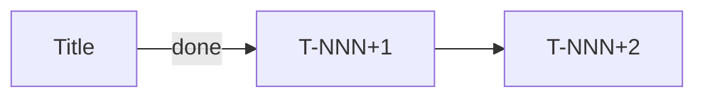

Mantenha o estado canônico de iniciativas em `.atomic-skills/` — ler, criar, atualizar e exibir.

## Regra Fundamental

NO IMPLEMENTATION WITHOUT ANCHORED INITIATIVE.

Todo código modificado deve ser ancorado a uma iniciativa ativa em `.atomic-skills/initiatives/<slug>.md`, ou o usuário deve declarar explicitamente "ad-hoc".

## Detecção inicial

Rode com {{BASH_TOOL}}:
- `test -d .atomic-skills/` — se não existe, entre em modo setup
- Se existe, leia `.atomic-skills/PROJECT-STATUS.md` e determine iniciativa ativa

## Modos

Ver seções abaixo conforme os args recebidos em {{ARG_VAR}}.

## Setup (quando `.atomic-skills/` não existe)

Anuncie: "Vou configurar project-status neste repo."

### 1. Detectar ambiente
- `test -d .claude/` → Claude Code
- `test -d .cursor/` → Cursor
- `test -d .gemini/` → Gemini CLI
- Caso contrário → IDE genérica; pule passo 5

### 2. Verificar/criar CLAUDE.md
- Se CLAUDE.md ausente: pergunte "Criar CLAUDE.md mínimo com hard-gate? (y/n)" — se sim, crie com um título + template hard-gate
- Se CLAUDE.md existe: prepare-se para injetar bloco entre markers

### 3. Injetar hard-gate em CLAUDE.md (idempotente)
Leia `skills/shared/project-status-assets/CLAUDE.md-gate.template.md` (assets empacotados com a skill).
Verifique se markers `<!-- atomic-skills:status-gate:start -->` já existem:
- Se sim e conteúdo idêntico: pule
- Se sim e conteúdo diferente: apresente diff, pergunte se atualiza
- Se não: append ao final de CLAUDE.md

### 4. AGENTS.md redirect
- Se AGENTS.md ausente: crie a partir de `skills/shared/project-status-assets/AGENTS.md.template.md`
- Se AGENTS.md existe e referencia CLAUDE.md: pule
- Se AGENTS.md existe sem referência: apresente diff sugerindo adição, peça confirmação (não force)

### 5. Instalar hooks (apenas Claude Code)
Apresente Structured Options:
> Qual nível de enforcement?
> (a) Passive — só hard-gate em CLAUDE.md, sem hooks
> (b) Soft (recomendado) — hard-gate + SessionStart hook
> (c) Strict — hard-gate + SessionStart + Stop hook (dry-run 7d antes de strict real)

Para (b) e (c): copie scripts para `.atomic-skills/status/hooks/`, registre em `.claude/settings.local.json`.
Para (c): copie `config.json` com `strict_mode: false` e `dry_run_started: $(date -I)`.

### 6. Criar estrutura

Use {{BASH_TOOL}}:
```bash
mkdir -p .atomic-skills/initiatives/archive
mkdir -p .atomic-skills/status/hooks
```

Copie `PROJECT-STATUS.md.template.md` para `.atomic-skills/PROJECT-STATUS.md`, substituindo `REPLACE_ISO_TIMESTAMP` pelo timestamp atual.

### 7. Atualizar .gitignore
Append (se não existente):
```
.atomic-skills/status/stop.log
.atomic-skills/status/SKIP
.atomic-skills/initiatives/*.rendered.md
```

### 8. Reportar
Liste tudo que foi criado e dê instruções de rollback (`git status` + `git restore`).

## Modos de exibição

### Default (sem args, estrutura existe)

Se há uma iniciativa ativa cuja `branch:` bate com `git rev-parse --abbrev-ref HEAD`:
- Leia `.atomic-skills/initiatives/<slug>.md`, parse frontmatter YAML
- Renderize no terminal:
  1. Header: `▸ <slug> · <status> · depth <N> · updated <timestamp-humano>`
  2. STACK (árvore com box-drawing): cada frame do `stack:` indentado; marque último com ` ◉ HERE`
  3. TASKS (tabela): ID | Title | State-com-ícone | Updated
  4. PARKED + EMERGED lado a lado (2 colunas)
  5. NEXT: `<next_action>` do frontmatter

Ícones Unicode:
- `✓` done, `◉` active, `·` pending, `⊘` blocked, `⌂` parked, `⇥` emerged
- `◉ HERE` marca frame ativo
- `←` ou `waits X` para dependências

Cores ANSI (respeitando `$NO_COLOR`):
- done → verde, active/HERE → ciano, pending/— → cinza, blocked → amarelo, parked → magenta

### `--list`

Tabela de todas iniciativas com `status: active`:

```
┌────────────────┬─────────┬─────────────┬──────────────┬────────────────────────┐
│ Slug           │ Status  │ Started     │ Branch       │ Next Action            │
├────────────────┼─────────┼─────────────┼──────────────┼────────────────────────┤
│ <slug>         │ active  │ YYYY-MM-DD  │ <branch>     │ <next_action>          │
└────────────────┴─────────┴─────────────┴──────────────┴────────────────────────┘
```

### `--stack`

Apenas a seção STACK da iniciativa ativa. 3-8 linhas. Para check rápido mid-session.

### `--archived`

Últimas 10 entradas de `.atomic-skills/initiatives/archive/`, tabular.

## Parsing YAML do frontmatter

Use `src/yaml.js` do repo atomic-skills via {{BASH_TOOL}}:

```bash
node -e "import('./node_modules/@henryavila/atomic-skills/src/yaml.js').then(({parse}) => { const fs = require('fs'); const content = fs.readFileSync('.atomic-skills/initiatives/<slug>.md','utf8'); const fm = content.match(/^---\\n([\\s\\S]*?)\\n---/); console.log(JSON.stringify(parse(fm[1]))); })"
```

Na prática: você (LLM) pode parsear o YAML direto já que é texto; use `src/yaml.js` como referência de robustness quando necessário.

## Modos de mutação

Em cada caso, atualize `.atomic-skills/initiatives/<slug>.md` (frontmatter YAML) e bump `last_updated:` para agora (`date -u +%Y-%m-%dT%H:%M:%SZ`).

### `new <slug>`

1. Valide slug: regex `^[a-z][a-z0-9-]{1,39}$`. Rejeite com mensagem clara se inválido.
2. Verifique duplicata: se `.atomic-skills/initiatives/<slug>.md` existe, aborte com sugestão de nome.
3. Pergunte ao usuário (se não for óbvio do contexto):
   - Título/descrição inicial
   - Branch associada (auto-preenche com `git branch --show-current` se nenhuma fornecida)
   - Caminho para plan doc (opcional, grava em `plan_link:`)
4. Copie `skills/shared/project-status-assets/initiative.template.md` para `.atomic-skills/initiatives/<slug>.md`, substituindo todos os `REPLACE_*` markers.
5. Append linha à tabela "Active Initiatives" em `.atomic-skills/PROJECT-STATUS.md`.
6. Reporte ao usuário com path criado.

### `push <descrição>`

1. Identifique iniciativa ativa (via branch match ou `--slug` explicit arg).
2. Leia `stack:` do frontmatter.
3. Append frame novo: `{id: <max_id+1>, title: "<descrição>", type: <inferido>, opened_at: <now>}`.
4. Salve.
5. Announce: "Frame <N> pushed: <descrição>. Current depth: <N>."
6. Se depth > `max_stack_depth_warning` (de config.json), alerte: "Stack profundo — ainda é a mesma iniciativa?"

Tipos inferidos do verbo: "research/pesquisar" → research; "test/testar" → validation; "discuss/discutir" → discussion; caso contrário → task.

### `pop [--resolve|--park|--emerge]`

1. Identifique top frame do stack.
2. Destino:
   - `--resolve` (default): remove do stack, adiciona nota em Done se era task
   - `--park`: move conteúdo para `parked:` (mesma iniciativa)
   - `--emerge`: move para `emerged:` (candidato a nova iniciativa)
3. Remova frame do stack.
4. Announce: "Frame <N> popped to <destino>. Current frame: <novo top>."
5. Atualize `last_updated` e salve.

### `park <descrição>`

1. Identifique iniciativa ativa.
2. Append a `parked:`: `{title: "<descrição>", surfaced_at: <now>, from_frame: <current-top-id>}`.
3. Salve.

### `emerge <descrição>`

1. Identifique iniciativa ativa.
2. Append a `emerged:`: `{title: "<descrição>", surfaced_at: <now>, promoted: false}`.
3. Salve.
4. Ofereça: "Criar nova iniciativa agora para '<descrição>'? (`new <slug>`)" — se sim, chame handler `new`.

### `promote <parking-item-title-or-index>`

1. Localize item em `parked:`.
2. Gere próximo task ID (`T-<NNN+1>` baseado no maior existente).
3. Adicione a `tasks:`: `<id>: {title: <título do parking>, status: pending, last_updated: <now>}`.
4. Remova item de `parked:`.
5. Announce novo task ID.

### `done <task-id>`

1. Localize task em `tasks:`.
2. Mude `status: done`, adicione `closed_at: <now>`.
3. Salve.
4. Announce.

### `archive [<slug>]`

1. Identifique iniciativa (arg ou ativa).
2. Mude frontmatter `status: archived`.
3. Mova arquivo para `.atomic-skills/initiatives/archive/<YYYY-MM>-<slug>.md`.
4. Remova linha de "Active Initiatives" em PROJECT-STATUS.md; append linha em "Recently Archived" (mantendo apenas últimas 10).
5. Announce.

### `switch <slug>`

1. Busque iniciativa alvo. Se não existe ou status não é active/paused, aborte.
2. Encontre iniciativa atualmente active. Mude `status: paused`.
3. Mude alvo para `status: active`.
4. Atualize PROJECT-STATUS.md index.
5. Announce.

## Fluxo de Disambiguation

Dispara quando: branch atual não bate com nenhuma iniciativa ativa, OU múltiplas batem, OU `disambiguate` for chamado explicitamente.

Apresente Structured Options:

```
Detected context:
- Branch: <branch-atual>
- No matching active initiative in .atomic-skills/PROJECT-STATUS.md

Active initiatives:
  1. <slug-1> (branch <branch-1>, last updated <timestamp>)
  2. <slug-2> (branch <branch-2>, <status>)

Is this work:
  (a) Continuation of an existing initiative (pick: 1 or 2)
  (b) Lateral expansion of an existing initiative (pick: 1 or 2; new frame added to its stack)
  (c) A new initiative (skill will prompt for name, goal)
  (d) Ad-hoc work (no initiative anchor)
```

Por escolha:
- (a): carregue arquivo selecionado; pergunte onde no stack retomar
- (b): carregue arquivo; `push` novo frame para expansão lateral
- (c): chame handler `new`
- (d): append linha em "Ad-Hoc Sessions Log" de PROJECT-STATUS.md com timestamp + descrição curta

## `--browser [<slug>]`

1. Determine slug (arg ou iniciativa ativa).
2. **Pergunte confirmação** (regra de intrusive actions):
   > "Open initiative in browser? (y/N)"
   Se não, aborte.
3. Gere renderização em `.atomic-skills/initiatives/<slug>.rendered.md`:
   - Header com metadata
   - Mermaid Gantt das tasks (done/active/blocked)
   - Mermaid flowchart de dependências (T-X → T-Y via blocker)
   - Stack como lista MD aninhada
   - Tasks como tabela MD
   - Parked + Emerged como bullets
   - Corpo narrativo do source file (passthrough)
4. Execute com {{BASH_TOOL}}:
   ```bash
   npx -y @henryavila/mdprobe view .atomic-skills/initiatives/<slug>.rendered.md
   ```
5. Reporte URL exibida pelo mdprobe.

Template Mermaid Gantt:
```mermaid
gantt
    title <slug>
    dateFormat YYYY-MM-DD
    section Done
    <Task> :done, <start>, <end>
    section Active
    <Task> :active, <start>, <duration>
    section Blocked
    <Task> :crit, after <blocker>, <duration>
```

Template Mermaid Flowchart:


## `--report`

Emita MD no stdout, formato pasteable para standup/PR/update:

```markdown
# Project Status — YYYY-MM-DD

## Active Initiatives

### <slug> (started YYYY-MM-DD)
**Next:** <next_action>
**Progress:** <N tasks done>; <M in progress> (stack depth <D>)
**Parked:** <lista>
**Emerged:** <lista>

### <slug-2> ...
```

Sem browser launch; stdout puro.
